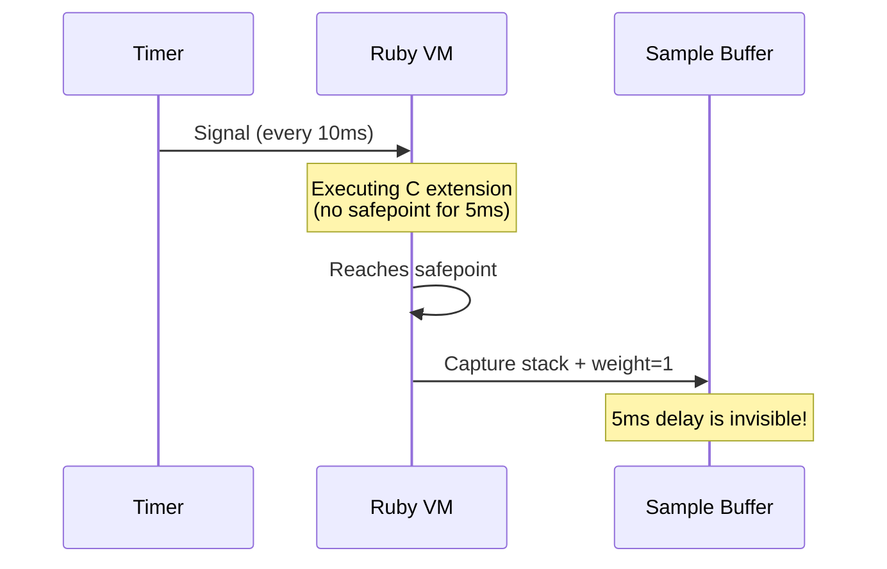
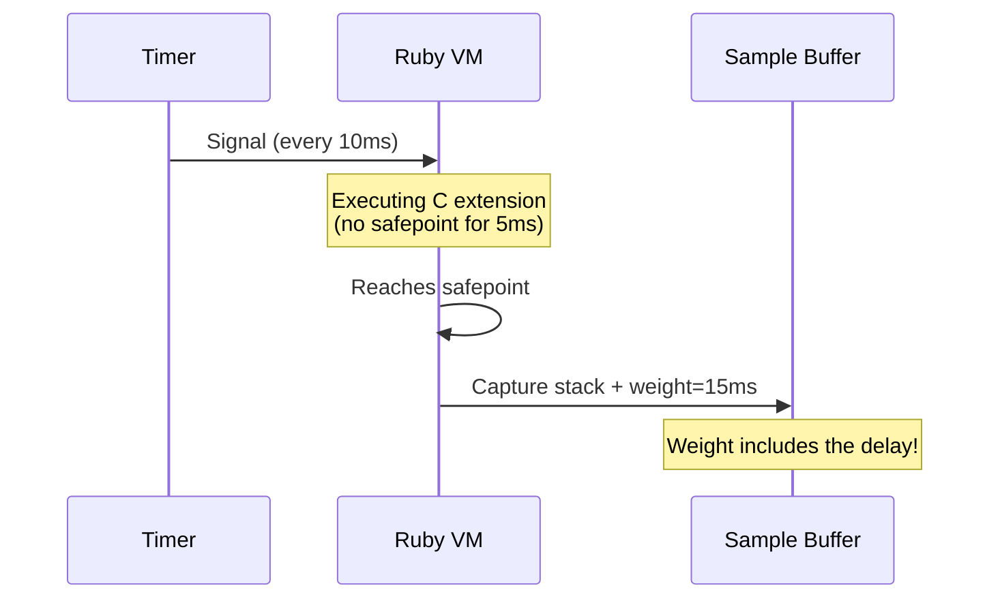

# Introduction

## Why Profile Ruby Applications?

Performance matters. As [Knuth](#cite:knuth1971) observed in his empirical study of programs, a small fraction of code is responsible for the majority of execution time. Profiling is the systematic process of identifying where that time is spent, enabling developers to focus optimization efforts where they have the greatest impact.

Ruby applications -- whether web services running Rails, background job processors, or data pipelines -- frequently encounter performance bottlenecks. These bottlenecks can arise from:

- **CPU-bound computation**: Tight loops, serialization, template rendering
- **GVL contention**: Multiple threads competing for Ruby's Global VM Lock
- **GC pressure**: Excessive object allocation triggering frequent garbage collection
- **I/O blocking**: Database queries, HTTP requests, file operations

A good profiler helps you distinguish between these categories and pinpoint the exact methods responsible.

## The Safepoint Bias Problem

Ruby's VM, like the JVM, can only inspect thread state at **safepoints** -- points where the VM is in a consistent state (between bytecode instructions, at method boundaries, etc.). When a sampling profiler's timer fires, the actual stack capture is deferred until the next safepoint.

This creates **safepoint bias**: a systematic distortion in profiling results [Mytkowicz et al.](#cite:mytkowicz2010) demonstrated that this bias can cause profilers to disagree on which methods are hotspots, sometimes pointing to completely wrong code.

Traditional profilers assign **uniform weight** to every sample (1 sample = 1 interval). If the timer fires at T=0 but the safepoint arrives at T=5ms, the 5ms delay is invisible -- the sample is counted the same as one collected instantly. This means:

- Code running long stretches without safepoints (C extensions, tight native loops) is **underrepresented**
- Code near frequent safepoints is **overrepresented**
- The profiler's output may not reflect reality

## What sprof Does Differently

sprof solves safepoint bias by using **actual time deltas as sample weights** instead of counting samples uniformly.

Each sample's weight is `clock_now - clock_prev` in nanoseconds. If a safepoint is delayed by 5ms, the sample carries 15ms of weight (the 10ms interval plus the 5ms delay). If two safepoints are close together, the sample carries a small weight. The total weight across all samples equals the total elapsed time, accurately distributed across observed call stacks.

This is a simple but powerful correction. The insight is that safepoint delay is not lost information -- it can be measured and accounted for.

## Key Features

sprof provides a focused set of features designed for accurate profiling:

| Feature | Description |
|---------|-------------|
| **Time-delta weighting** | Corrects safepoint bias by weighing each sample by actual elapsed time |
| **CPU and wall clock modes** | Per-thread CPU time or wall-clock time |
| **GVL event tracking** | Records off-GVL time and GVL contention (wall mode) |
| **GC phase tracking** | Attributes GC marking and sweeping time to triggering code |
| **pprof output** | Industry-standard format viewable with `go tool pprof` |
| **Low overhead** | No allocation during sampling; deferred string resolution |
| **CLI and library API** | Profile any Ruby program with zero code changes, or integrate into your application |

## Target Environment

sprof is designed for:

- **Ruby >= 4.0.0** -- uses internal thread event APIs introduced in modern Ruby
- **Linux only** -- uses the Linux kernel ABI for per-thread CPU clocks (`~tid << 3 | 6`)
- **MRI (CRuby)** -- depends on CRuby VM internals; not compatible with JRuby or TruffleRuby

> [!NOTE]
> The Linux-only requirement comes from sprof's use of per-thread CPU time clocks via `clock_gettime` with thread-specific clockids derived from the native TID. This is a Linux kernel ABI that is not available on macOS or other platforms.
