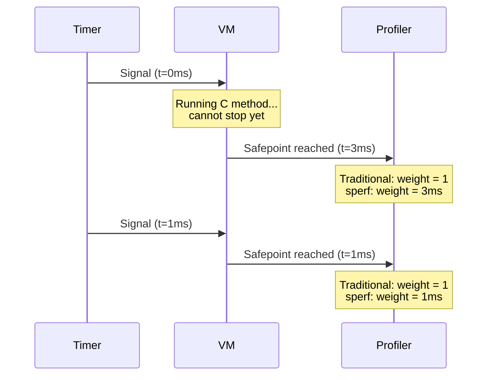

# Introduction

## What is sperf?

[sperf](#index) is a [safepoint](#index:safepoint)-based [sampling](#index:sampling) performance profiler for Ruby. It helps you find where your Ruby program spends its time — whether that's CPU computation, I/O waits, [GVL](#index:GVL) contention, or garbage collection.

Unlike traditional sampling profilers that count samples uniformly, sperf uses actual time deltas (in nanoseconds) as [weight](#index:weight)s for each sample. This corrects the [safepoint bias](#index:safepoint bias) problem inherent in [postponed job](#index:postponed job)-based sampling, producing more accurate results.

sperf is inspired by Linux [perf](#cite:demelo2010), providing a familiar CLI interface with subcommands like `record`, `stat`, and `report`.

### Advantages

- **Accurate profiling**: Time-delta weighting corrects [safepoint bias](#index:safepoint bias), producing results closer to real time distribution than traditional count-based profilers.
- **GVL / GC visibility**: In wall mode, tracks off-GVL blocking, GVL contention, and GC marking/sweeping as distinct frames — no separate tool needed.
- **Standard output formats**: Outputs [pprof](#index:pprof) protobuf (compatible with `go tool pprof`), [collapsed stacks](#index:collapsed stacks) (for flame graphs / speedscope), and human-readable text.
- **Low overhead**: Default 1000 Hz sampling callback cost is < 0.2%, suitable for production.
- **Simple CLI**: `sperf stat` for a quick overview, `sperf record` + `sperf report` for detailed analysis.

### Limitations

- **Ruby 3.4+ only**: Requires APIs introduced in Ruby 3.4.
- **POSIX only**: Linux and macOS. Windows is not supported.
- **Method-level granularity**: No line-number resolution — profiles show method names only.
- **Single session**: Only one profiling session can be active at a time (global state in the C extension).
- **Safepoint latency**: Samples are still deferred to safepoints. The time-delta weighting corrects the *bias* but cannot recover the exact interrupted instruction pointer.

## Why another profiler?

Ruby already has profiling tools like [stackprof](#cite:stackprof). So why sperf?

### The safepoint bias problem

Most Ruby sampling profilers collect backtraces by calling `rb_profile_frames` directly in the signal handler. This approach yields backtraces at the actual signal timing, but relies on undocumented internal VM state — `rb_profile_frames` is not guaranteed to be async-signal-safe, and the results can be unreliable if the VM is in the middle of updating its internal structures.

sperf takes a different approach: it uses the [postponed job](#index:postponed job) mechanism (`rb_postponed_job`), which is the Ruby VM's official API for safely deferring work from signal handlers. Backtrace collection is deferred to the next [safepoint](#index:safepoint) — a point where the VM is in a consistent state and `rb_profile_frames` can return reliable results. The trade-off is that when a timer fires between safepoints, the actual sample is delayed until the next safepoint.

If each sample were counted equally (weight = 1), a sample delayed by a long-running C method would get the same weight as one taken immediately. This is the [safepoint bias](#cite:mytkowicz2010) problem: functions that happen to be running when the thread reaches a safepoint appear more often than they should, while functions between safepoints are under-represented.



sperf solves this by recording `clock_now - clock_prev` as the weight of each sample. A sample delayed by 3ms gets 3x the weight of a 1ms sample, accurately reflecting where time was actually spent.

### Other advantages

- **GVL and GC awareness**: In wall mode, sperf tracks time spent blocked off the GVL, waiting to reacquire the GVL, and in GC marking/sweeping phases — each as distinct [synthetic frames](#index:synthetic frames).
- **perf-like CLI**: The [`sperf stat`](#index:sperf stat) command gives you a quick performance overview (like `perf stat`), while [`sperf record`](#index:sperf record) + [`sperf report`](#index:sperf report) gives you detailed profiling.
- **Standard output**: sperf outputs [pprof](#index:pprof) protobuf format, compatible with Go's `pprof` tool ecosystem, as well as [collapsed stacks](#index:collapsed stacks) for [flame graphs](#cite:gregg2016) and speedscope.
- **Low overhead**: Default 1000 Hz sampling callback cost is < 0.2%, suitable for production use.

## Requirements

- Ruby >= 3.4.0
- POSIX system (Linux or macOS)
- Go (optional, for `sperf report` and `sperf diff` subcommands)

## Quick start

Profile a Ruby script and view the results:

```bash
# Install sperf
gem install sperf

# Quick performance overview
sperf stat ruby my_app.rb

# Record a profile and view it interactively
sperf record ruby my_app.rb
sperf report
```

Or use sperf from Ruby code:

```ruby
require "sperf"

Sperf.start(output: "profile.pb.gz") do
  # code to profile
end
```
