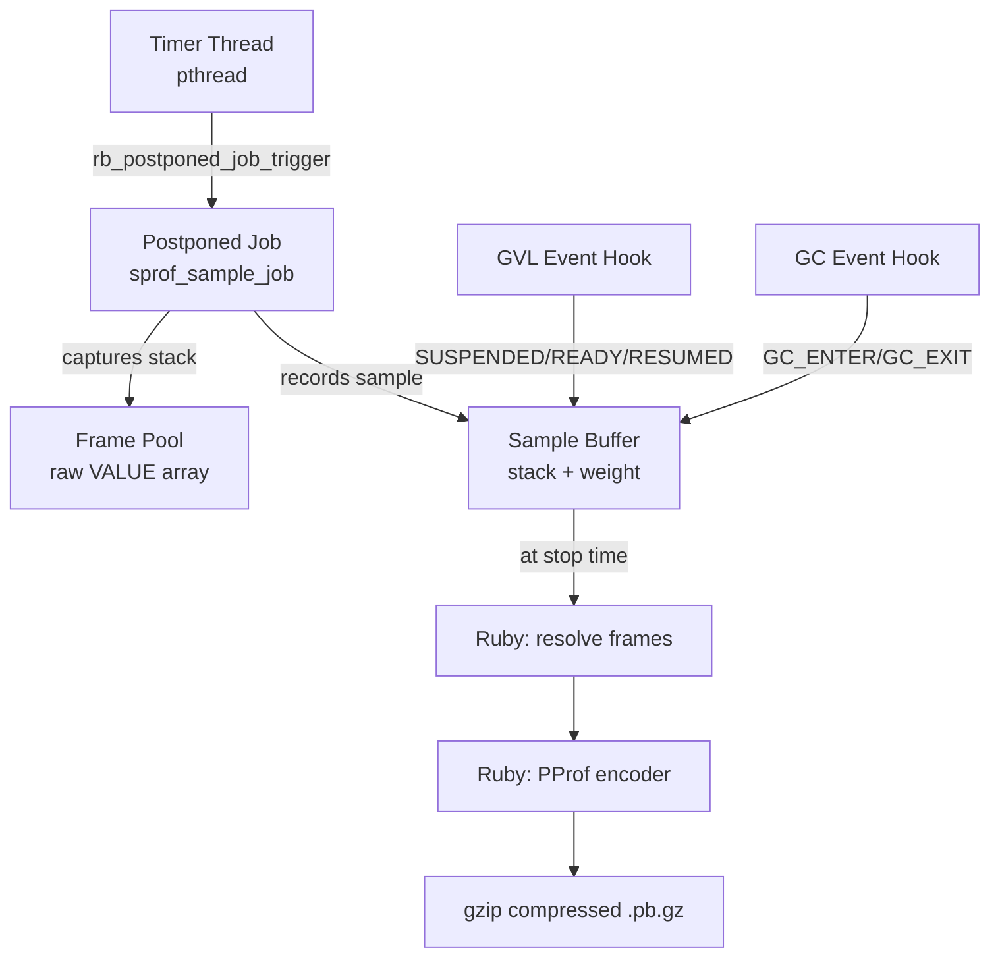
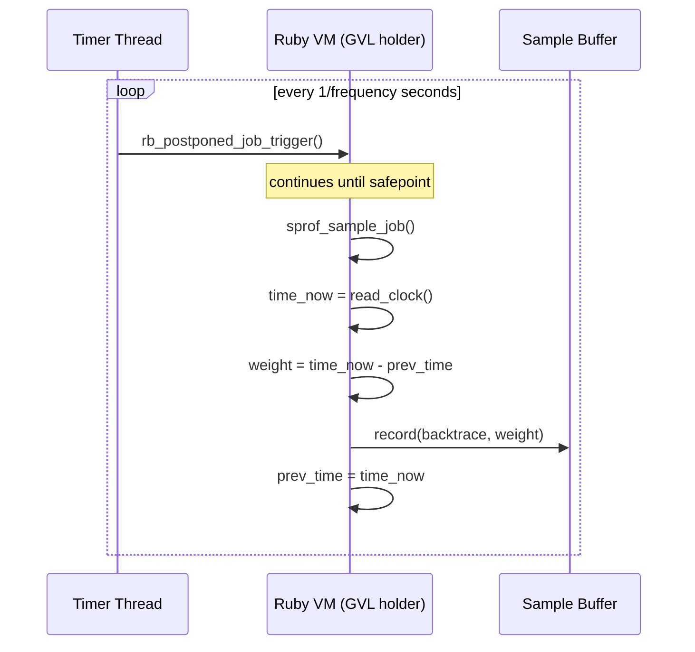
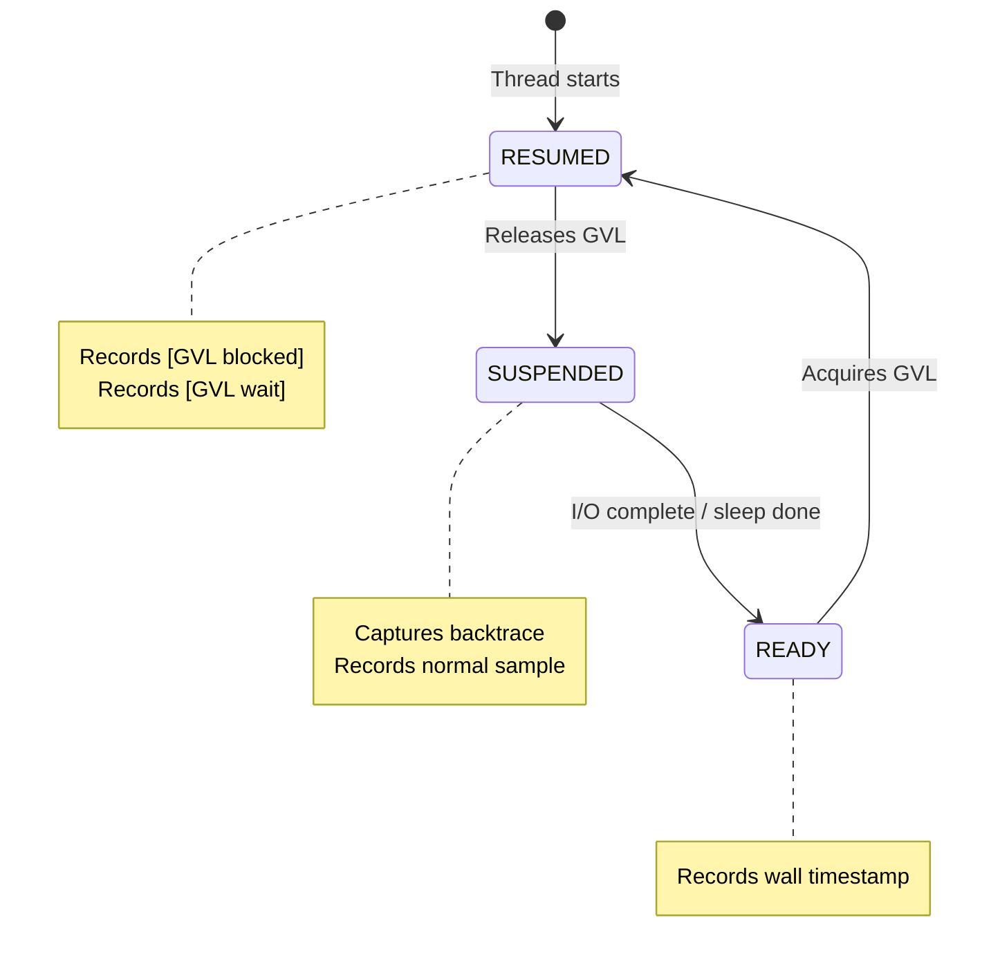
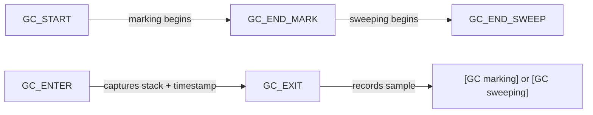
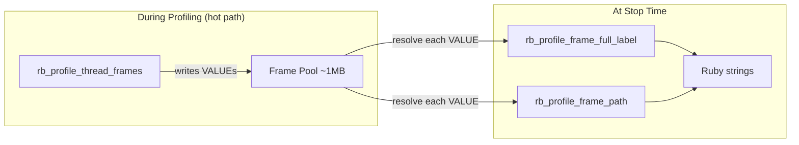

# How sprof Works

## Architecture Overview

sprof is implemented as a C extension (`ext/sprof/sprof.c`) with a Ruby wrapper (`lib/sprof.rb`). The C extension handles all time-critical sampling operations, while the Ruby layer provides the user API and pprof encoding.



The profiler uses a single global `sprof_profiler_t` structure. Only one profiling session can be active at a time.

## Timer Thread and Postponed Jobs

The core sampling mechanism uses two cooperating threads:

1. **Timer thread**: A native pthread that fires at the configured frequency (default 100 Hz). It calls `rb_postponed_job_trigger()` to request a sampling callback.

2. **Postponed job callback**: Runs on the Ruby thread that currently holds the GVL. At the next safepoint, the VM executes `sprof_sample_job()`.



The callback samples only `rb_thread_current()` -- the thread currently holding the GVL. This avoids the overhead of iterating `Thread.list` and is sufficient because the GVL ensures only one Ruby thread executes at a time. Combined with GVL event hooks, this provides complete thread coverage.

## Time-Delta Weighting

The core innovation of sprof is using elapsed time as sample weight rather than counting samples uniformly.

For each sample, the weight is computed as:

```
weight = clock_now - clock_prev
```

Where `clock_now` is the current time at the safepoint, and `clock_prev` is the time recorded at the previous sample for this thread. The weight is in nanoseconds.

This means:

- A sample taken 10ms after the previous one carries 10ms of weight
- A sample delayed by 5ms due to safepoint latency carries the extra 5ms in its weight
- The sum of all weights equals the total profiled time

No time is "lost" between samples, regardless of safepoint delay.

## Clock Sources

sprof supports two clock modes:

| Mode | Clock Source | Scope | Measures |
|------|-------------|-------|----------|
| `:cpu` (default) | `clock_gettime(thread_cputime_id)` | Per-thread | CPU time consumed (excludes sleep, I/O) |
| `:wall` | `clock_gettime(CLOCK_MONOTONIC)` | Global | Real elapsed time (includes everything) |

### CPU Mode

In CPU mode, sprof uses per-thread CPU clocks provided by the Linux kernel. The clock ID is derived from the native thread ID (TID):

```c
clockid_t cid = ~(clockid_t)(tid) << 3 | 6;
```

This gives a clock that advances only when the specific thread is running on a CPU core. Sleep, I/O waits, and GVL contention are excluded. The TID is cached per-thread at first use via `syscall(SYS_gettid)` to avoid repeated syscalls.

### Wall Mode

Wall mode uses `CLOCK_MONOTONIC`, which advances at a constant rate regardless of what the thread is doing. This captures everything: CPU time, sleep, I/O, GVL waits, and scheduling delays.

## GVL Event Tracking

In wall mode, sprof hooks GVL state transitions to capture time spent off-GVL and waiting for the GVL:



At each transition:

- **SUSPENDED**: The thread is releasing the GVL (e.g., entering a blocking I/O call). sprof captures the current backtrace and records a normal sample with time since the previous event.
- **READY**: The thread's blocking operation has completed and it is waiting to reacquire the GVL. sprof records the wall timestamp (no GVL needed for this).
- **RESUMED**: The thread has reacquired the GVL. sprof records two synthetic samples using the stack saved at SUSPENDED:
  - `[GVL blocked]`: Time from SUSPENDED to READY (off-GVL time, e.g., I/O duration)
  - `[GVL wait]`: Time from READY to RESUMED (GVL contention time)

These synthetic frames appear in the pprof output as leaf frames, showing which code caused GVL releases and how long threads waited.

> [!IMPORTANT]
> GVL event samples are only recorded in wall mode. In CPU mode, CPU time does not advance while a thread is off-GVL, so these samples would carry zero weight.

## GC Phase Tracking

sprof hooks Ruby's internal GC events to track time spent in garbage collection:



GC tracking works as follows:

1. `GC_START` / `GC_END_MARK` / `GC_END_SWEEP` events track which GC phase is active (marking or sweeping)
2. `GC_ENTER` captures the backtrace of the code that triggered GC and records the entry timestamp
3. `GC_EXIT` records a sample with the saved stack, a synthetic `[GC marking]` or `[GC sweeping]` leaf frame, and wall time weight

GC samples always use wall time regardless of profiling mode, since GC may pause the thread's CPU clock.

## Deferred String Resolution

During sampling, sprof stores raw frame `VALUE`s (Ruby object pointers) in a frame pool. String resolution -- calling `rb_profile_frame_full_label()` and `rb_profile_frame_path()` -- happens only at stop time.

This design keeps the hot path allocation-free:



The frame pool is a raw `VALUE *` array (initial size ~1MB). A `TypedData` wrapper with `dmark` using `rb_gc_mark_locations` keeps the stored VALUEs alive across GC cycles. Both the sample buffer and frame pool grow by 2x on demand via `realloc`.

## Per-Thread State

Each Ruby thread has a `sprof_thread_data_t` stored via `rb_internal_thread_specific_key`:

| Field | Purpose |
|-------|---------|
| `tid` | Cached native TID for CPU time reads |
| `prev_cpu_ns` | Previous CPU clock value for weight computation |
| `prev_wall_ns` | Previous wall clock value |
| `suspended_at_ns` | Wall timestamp at SUSPENDED event |
| `ready_at_ns` | Wall timestamp at READY event |
| `suspended_frame_start` | Saved stack location in frame pool |
| `suspended_frame_depth` | Saved stack depth |

Thread data is created on first contact (RESUMED or SUSPENDED event, or first timer sample) via `sprof_thread_data_create()`. The first sample for each thread is skipped since there is no `prev_time` to compute a delta from. Thread cleanup is handled by `RUBY_INTERNAL_THREAD_EVENT_EXITED`.

## Output Pipeline

At stop time, the collected data passes through several stages:

1. **Frame resolution**: Raw `VALUE`s are resolved to `[path, label]` string pairs
2. **Synthetic frame injection**: GVL and GC samples get synthetic leaf frames prepended
3. **Stack merging**: Identical stacks have their weights summed in the [pprof](#cite:pprof) encoder
4. **Protobuf encoding**: A hand-written encoder in `lib/sprof.rb` produces the pprof protobuf format (no protobuf gem dependency)
5. **Gzip compression**: The encoded data is gzip-compressed and written to disk

The output is directly viewable with `go tool pprof`.
