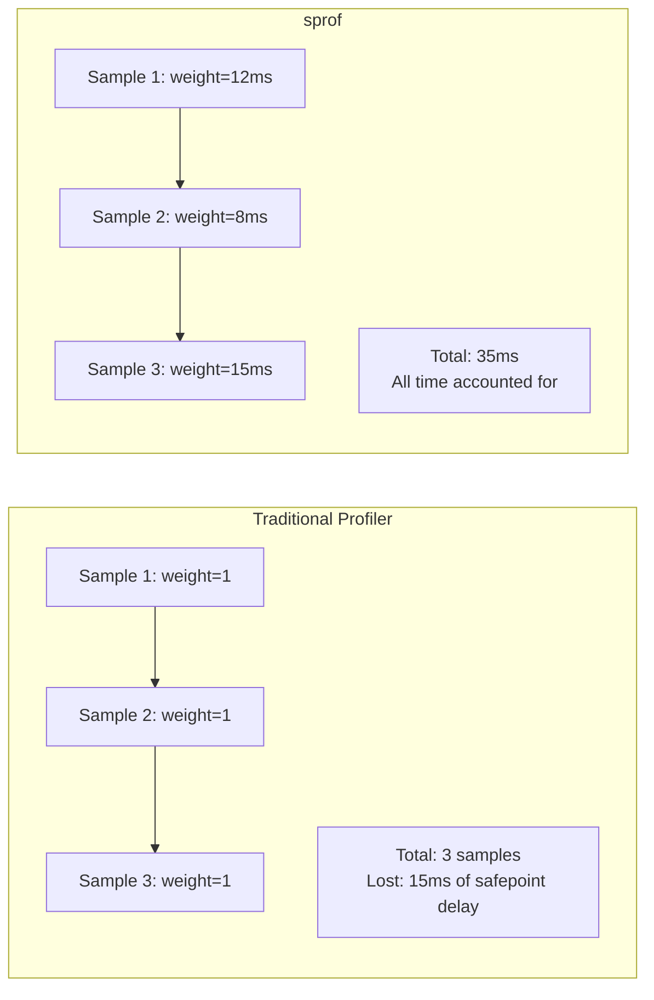

# Comparison with Other Profilers

## The Ruby Profiling Landscape

Several sampling profilers exist for Ruby. Each takes a different approach to stack sampling, time measurement, and output format. Understanding these differences helps you choose the right tool for your use case.

## StackProf

[StackProf](#cite:stackprof) is the most widely used Ruby sampling profiler, created by Aman Gupta (tmm1). It supports CPU, wall, and object allocation modes.

**How it works**: StackProf uses `setitimer` (SIGPROF/SIGALRM) or `rb_tracepoint` for timer-based sampling. Each sample is counted with **uniform weight** (1 sample = 1 count).

**Limitations**:

- **Safepoint bias**: Samples are weighted uniformly, so time between the timer signal and the next safepoint is not accounted for. This systematically underrepresents C extension code and tight native loops.
- **C extension visibility**: Sampling occurs at the Ruby frame level. Loops inside C functions are largely invisible because no Ruby-level safepoint is reached during execution.
- **Custom output format**: Uses its own marshalled Ruby hash format, requiring the `stackprof` gem to view results.

## Vernier

[Vernier](#cite:vernier) is a modern profiler by John Hawthorn (Ruby committer, Rails core team). It tracks multiple threads, GVL activity, GC pauses, and allocation data.

**How it works**: Vernier uses signal-based sampling with `CLOCK_MONOTONIC` or `CLOCK_PROCESS_CPUTIME_ID`. It outputs Firefox Profiler JSON format, viewable at https://vernier.prof.

**Strengths**:

- Excellent thread visibility and GVL tracking
- Combined timing and allocation data in a single profile
- Rich visualization via Firefox Profiler frontend

**Limitations**:

- **Uniform sample weighting**: Like StackProf, each sample counts as one unit. Safepoint bias is not corrected.
- **No per-thread CPU time**: Uses process-wide CPU clock, not per-thread. Cannot isolate one thread's CPU consumption.
- **Cannot measure GVL-held sleep**: `csleep` (sleep while holding GVL) is invisible because the timer signal cannot be delivered to a sleeping thread that holds the GVL.

## Accuracy Comparison

sprof includes a benchmark suite that measures profiling accuracy against known workloads. The benchmark generates workloads with precise expected execution times and compares profiler output against those expectations.

### Methodology

Four workload types are used:

| Type | Behavior | GVL | CPU time | Wall time |
|------|----------|-----|----------|-----------|
| `rw` | Ruby busy-wait | Held | Consumed | Consumed |
| `cw` | C busy-wait | Held | Consumed | Consumed |
| `csleep` | `nanosleep` (GVL held) | Held | 0 | Consumed |
| `cwait` | `nanosleep` (GVL released) | Released | 0 | Consumed |

Each workload method consumes a precise amount of time, allowing direct comparison between expected and measured values.

### Results

Accuracy on mixed workload scenarios (10 scenarios, tolerance 20%):

| Profiler | CPU mode | Wall mode |
|----------|----------|-----------|
| **sprof** | **PASS (0.2% avg error)** | **PASS (0.8% avg error)** |
| StackProf | FAIL (38% avg error) | FAIL (82% avg error) |
| Vernier | FAIL (64% avg error) | FAIL (35% avg error) |

> [!NOTE]
> These results are from mixed workloads that include C busy-wait and GVL-held sleep, which are particularly challenging for traditional profilers. On Ruby-only busy-wait workloads, all profilers perform reasonably well.

### Why Other Profilers Struggle

The high error rates for StackProf and Vernier on mixed workloads come from specific blind spots:

**StackProf** misses C busy-wait code (`cw`) because sampling occurs at the Ruby frame level. A C function running a tight loop with no Ruby-level safepoints receives few or no samples, causing ~60% of its execution time to be unaccounted for.

**Vernier** handles `rw` and `cw` well in wall mode but cannot measure `csleep` (GVL-held sleep). It also lacks a true per-thread CPU time mode.

### Under CPU Load

When system CPUs are saturated with competing processes:

- **sprof CPU mode**: Unaffected. Per-thread CPU clocks measure only the thread's own execution time, regardless of system load.
- **sprof wall mode**: Affected. Wall time for busy-wait methods inflates because OS scheduling gives the thread less CPU time.
- **Other profilers**: Similarly affected in wall mode, with additional safepoint bias compounding the error.

This demonstrates a key advantage of sprof's CPU mode: results are reproducible regardless of system load.

## When to Use Which Profiler

| Scenario | Recommended |
|----------|-------------|
| Accurate CPU time attribution | sprof (CPU mode) |
| Diagnosing GVL contention | sprof (wall mode) or Vernier |
| Production profiling of Rails apps | sprof (CLI, zero code changes) |
| Allocation profiling | Vernier |
| Rich visual exploration | Vernier (Firefox Profiler UI) |
| Flame graphs with `go tool pprof` | sprof |
| Cross-language teams using pprof | sprof |

## Fundamental Difference: Time-Delta vs Uniform Weighting

The fundamental difference between sprof and other profilers is how samples are weighted. As [Mytkowicz et al.](#cite:mytkowicz2010) showed, safepoint bias violates the assumption that sampling profilers collect samples at random program points. [Burchell et al.](#cite:burchell2023) further confirmed that this problem persists in modern profilers.

sprof's approach acknowledges that sample timing is not random and compensates by measuring the actual elapsed time. This is analogous to how [gprof](#cite:graham1982) combined instrumentation with sampling to provide more accurate call graph profiles -- using measured data to correct for statistical sampling limitations.

This correction is especially important for Ruby applications that heavily use C extensions (Nokogiri, native JSON parsers, database drivers), where significant execution time occurs in code that rarely hits Ruby safepoints.
