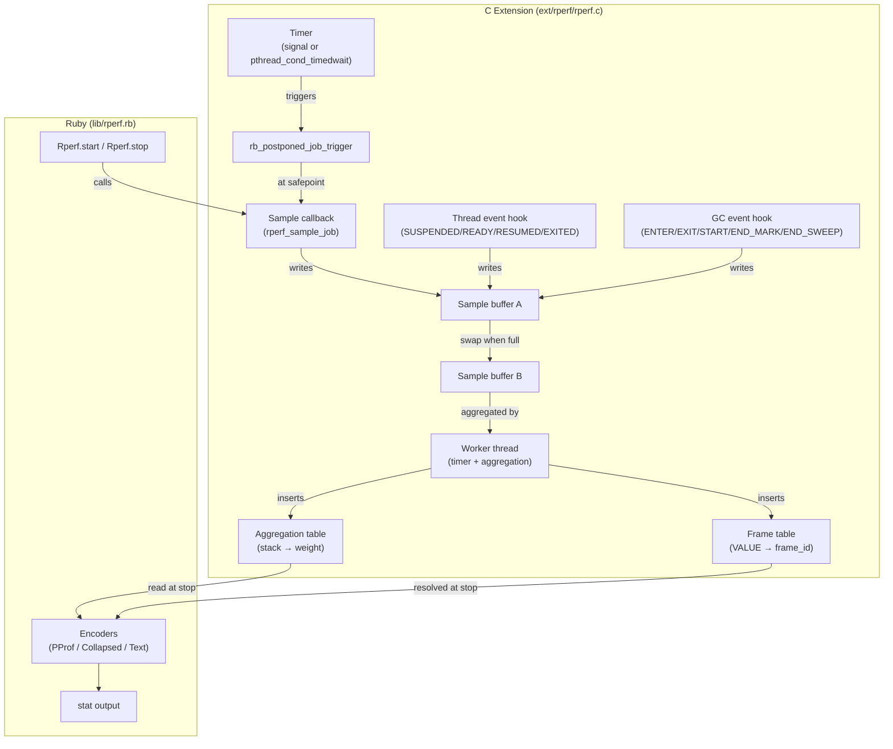
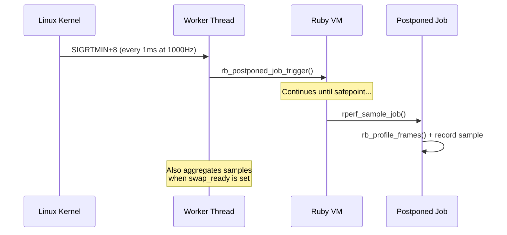
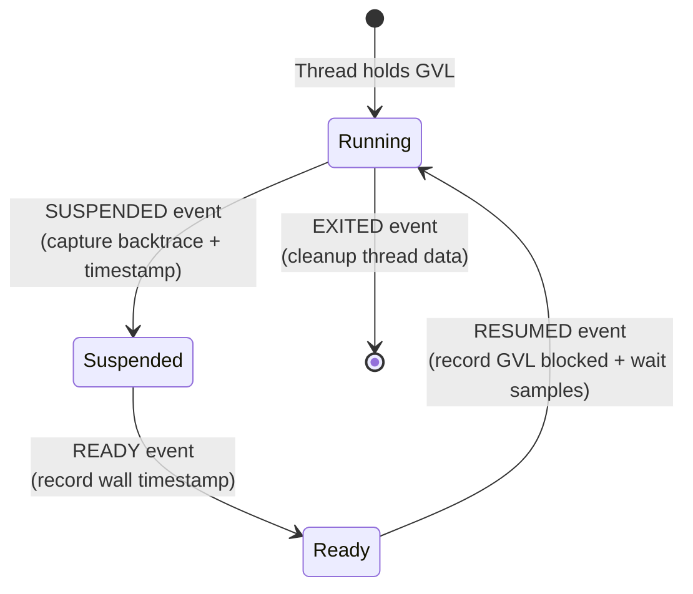

# Internals

This chapter describes how rperf works under the hood. Understanding the internals helps you interpret edge cases in profiling results and appreciate the design trade-offs.

## Architecture overview

rperf consists of a C extension and a Ruby wrapper:

## Global profiler state

rperf uses a single global `rperf_profiler_t` struct. Only one profiling session can be active at a time ([single session](#index:single session) limitation). The struct holds:

- Timer configuration (frequency, mode, signal number)
- Double-buffered sample storage (two sample buffers + frame pools, swapped when full)
- Frame table (VALUE → uint32 frame_id, deduplicates frame references)
- Aggregation table (unique stack → accumulated weight)
- Worker thread handle (unified timer + aggregation thread)
- Thread-specific key for per-thread data
- GC phase tracking state
- Sampling overhead counters

## Timer and worker thread

rperf uses a single worker thread that handles both timer triggering and periodic sample aggregation. The timer mechanism depends on the platform:

### Linux: Signal-based timer (default)

On Linux, rperf uses `timer_create` with `SIGEV_THREAD_ID` to deliver a real-time signal (default: `SIGRTMIN+8`) exclusively to the worker thread at the configured frequency. The signal handler calls `rb_postponed_job_trigger` to schedule the sampling callback.

Using `SIGEV_THREAD_ID` ensures the timer signal only targets the worker thread, preventing it from interrupting `nanosleep`, `read`, or other blocking syscalls in Ruby threads (e.g., inside `rb_thread_call_without_gvl`).

This approach provides precise timing (~1000us median interval at 1000Hz).

### Fallback: pthread_cond_timedwait

On macOS, or when `signal: false` is set on Linux, the worker thread uses `pthread_cond_timedwait` with an absolute deadline as the timer:

- **Timeout** (deadline reached): trigger `rb_postponed_job_trigger` and advance deadline
- **Signal** (swap_ready set): aggregate the standby buffer immediately

The deadline-based approach avoids drift when aggregation takes time. This mode has ~100us timing imprecision compared to the signal-based approach.

## Sampling: current-thread-only

When the postponed job fires, `rperf_sample_job` runs on whatever thread currently holds the GVL. It only samples that thread using `rb_thread_current()`.

This is a deliberate design choice:

1. `rb_profile_frames` can only capture the current thread's stack
2. There's no need to iterate `Thread.list` — combined with GVL event hooks, rperf gets broad coverage of all threads (though a [known race](#known-limitations) in the Ruby VM can cause occasional missed samples)

The sampling callback:

1. Gets or creates per-thread data (`rperf_thread_data_t`)
2. Reads the current clock (`CLOCK_THREAD_CPUTIME_ID` for CPU mode, `CLOCK_MONOTONIC` for wall mode)
3. Computes weight as `time_now - prev_time`
4. Captures the backtrace with `rb_profile_frames` directly into the frame pool
5. Records the sample (frame start index, depth, weight, type)
6. Updates `prev_time`

## GVL event tracking (wall mode)

In wall mode, rperf hooks into Ruby's thread event API to track GVL transitions. This captures time that sampling alone would miss — time spent off the GVL.

### SUSPENDED

When a thread releases the GVL (e.g., before I/O):

1. Capture the current backtrace into the frame pool
2. Record a normal sample (time since last sample)
3. Save the backtrace and wall timestamp for later use

### READY

When a thread becomes ready to run (e.g., I/O completed):

1. Record the wall timestamp (no GVL needed — only simple C operations)

### RESUMED

When a thread reacquires the GVL:

1. Record a `[GVL blocked]` sample: weight = `ready_at - suspended_at` (off-GVL time)
2. Record a `[GVL wait]` sample: weight = `resumed_at - ready_at` (GVL contention time)
3. Both samples reuse the backtrace captured at SUSPENDED

This way, off-GVL time and GVL contention are accurately attributed to the code that triggered them, even though no timer-based sampling can occur while the thread is off the GVL.

## GC phase tracking

rperf hooks into Ruby's internal GC events to track garbage collection time:

| Event | Action |
|-------|--------|
| `GC_START` | Set phase to marking |
| `GC_END_MARK` | Set phase to sweeping |
| `GC_END_SWEEP` | Clear phase |
| `GC_ENTER` | Capture backtrace + wall timestamp |
| `GC_EXIT` | Record `[GC marking]` or `[GC sweeping]` sample |

GC samples always use wall time regardless of the profiling mode, because GC time is real elapsed time that affects application latency.

## Deferred string resolution

During sampling, rperf stores raw frame `VALUE`s (Ruby internal object references) in the frame pool — not strings. This [deferred string resolution](#index:deferred string resolution) keeps the hot path allocation-free and fast.

String resolution happens at stop time:

1. `Rperf.stop` calls `_c_stop`
2. The frame table maps each unique frame VALUE to a `[path, label]` string pair via `rb_profile_frame_full_label` and `rb_profile_frame_path`
3. These resolved strings are passed to the Ruby encoders

This means sampling only writes integers (VALUE pointers and timestamps) to pre-allocated buffers. No Ruby objects are created, no GC pressure is added during profiling.

## Sample aggregation

By default (`aggregate: true`), rperf periodically aggregates samples to keep memory usage bounded during long profiling sessions.

### Double buffering

Two sample buffers alternate roles:

1. The **active buffer** receives new samples from sampling callbacks
2. When the active buffer reaches 10,000 samples, the buffers swap
3. The **standby buffer** is processed by the worker thread in the background

If the worker thread hasn't finished processing the standby buffer, the swap is skipped and the active buffer continues growing (fallback to unbounded mode).

### Frame table and aggregation table

The worker thread processes the standby buffer into two compact hash tables:

- **Frame table** (`VALUE → uint32_t frame_id`): Deduplicates frame references. Each unique frame VALUE gets a small integer ID. The keys array is the only GC mark target for aggregated data.
- **Aggregation table** (`(frame_ids[], thread_seq) → weight`): Merges identical stacks by summing their weights. Frame IDs (uint32_t) are half the size of VALUEs, and the stack pool stores them contiguously.

Synthetic frames (`[GVL blocked]`, `[GVL wait]`, `[GC marking]`, `[GC sweeping]`) are converted to reserved frame IDs during aggregation, eliminating the `type` field from the sample representation.

### Memory usage

| Buffer | Initial size | Element size | Initial memory |
|--------|-------------|-------------|----------------|
| Sample buffer (×2) | 16,384 | 32B | 512KB × 2 |
| Frame pool (×2) | 131,072 | 8B (VALUE) | 1MB × 2 |
| Frame table keys | 4,096 | 8B (VALUE) | 32KB |
| Frame table buckets | 8,192 | 4B (uint32) | 32KB |
| Agg table buckets | 2,048 | 28B | 56KB |
| Stack pool | 4,096 | 4B (uint32) | 16KB |

Total: ~3.6MB with `aggregate: true`, ~1.5MB with `aggregate: false` (single buffer only). Frame table and aggregation table grow dynamically as needed.

## GC safety

Frame VALUEs must be protected from garbage collection. rperf wraps the profiler struct in a `TypedData` object with a custom `dmark` function that marks three regions:

1. **Both frame pools** (active and standby buffers)
2. **Frame table keys** (unique frame VALUEs, excluding synthetic frame slots)

The frame table keys array starts at 4,096 entries and grows by 2× when full. Growth allocates a new array, copies existing data, and swaps the pointer atomically (`memory_order_release`). The old array is kept alive until `stop` to prevent use-after-free if GC's mark phase is reading it concurrently. The `dmark` function loads the keys pointer with `memory_order_acquire` and the count with `memory_order_acquire` to ensure a consistent view.

## Per-thread data

Each thread gets a `rperf_thread_data_t` struct stored via Ruby's thread-specific data API (`rb_internal_thread_specific_set`). This tracks:

- `prev_time_ns`: Previous time reading (for computing weight)
- `prev_wall_ns`: Previous wall time reading
- `suspended_at_ns`: Wall timestamp when thread was suspended
- `ready_at_ns`: Wall timestamp when thread became ready
- `suspended_frame_start`/`depth`: Saved backtrace from SUSPENDED event

Thread data is created lazily on first encounter and freed on the `EXITED` event or at profiler stop.

## Fork safety

rperf registers a `pthread_atfork` child handler that silently stops profiling in the forked child process ([fork safety](#index:fork safety)):

- Clears the timer/signal state
- Removes event hooks
- Frees sample buffers, frame table, and aggregation table

The parent process continues profiling unaffected. The child can start a fresh profiling session if needed.

## pprof encoder

rperf encodes the [pprof](#cite:ren2010) protobuf format entirely in Ruby, with no protobuf gem dependency. The encoder in `Rperf::PProf.encode`:

1. Builds a string table (index 0 is always the empty string)
2. Converts string frames to index frames and merges identical stacks
3. Builds location and function tables
4. Encodes the Profile protobuf message field by field

This hand-written encoder is simple (~100 lines) and only runs once at stop time, so performance is not a concern.

## Known limitations

### Running EC race

There is a known race condition in the Ruby VM where `rb_postponed_job_trigger` from the timer thread may set the interrupt flag on the wrong thread's execution context. This happens when a new thread's native thread starts before acquiring the GVL. The result is that timer samples may miss threads doing C busy-wait, with their CPU time leaking into the next SUSPENDED event's stack.

This is a Ruby VM bug, not a rperf bug, and affects all postponed-job-based profilers.

### Single session

Only one profiling session can be active at a time due to the global profiler state. Calling `Rperf.start` while already profiling is not supported.

### Method-level granularity

rperf profiles at the method level, not the line level. Frame labels use `rb_profile_frame_full_label` for qualified names (e.g., `Integer#times`, `MyClass#method_name`). Line numbers are not included.
