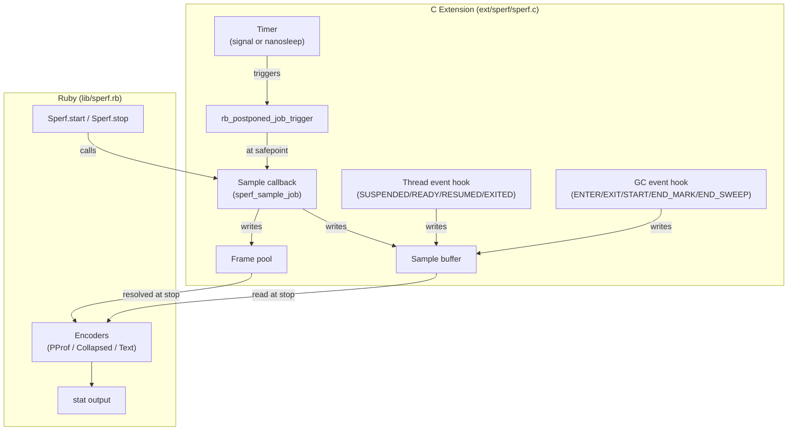
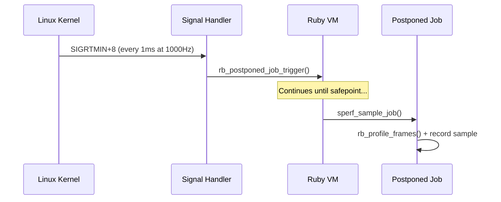
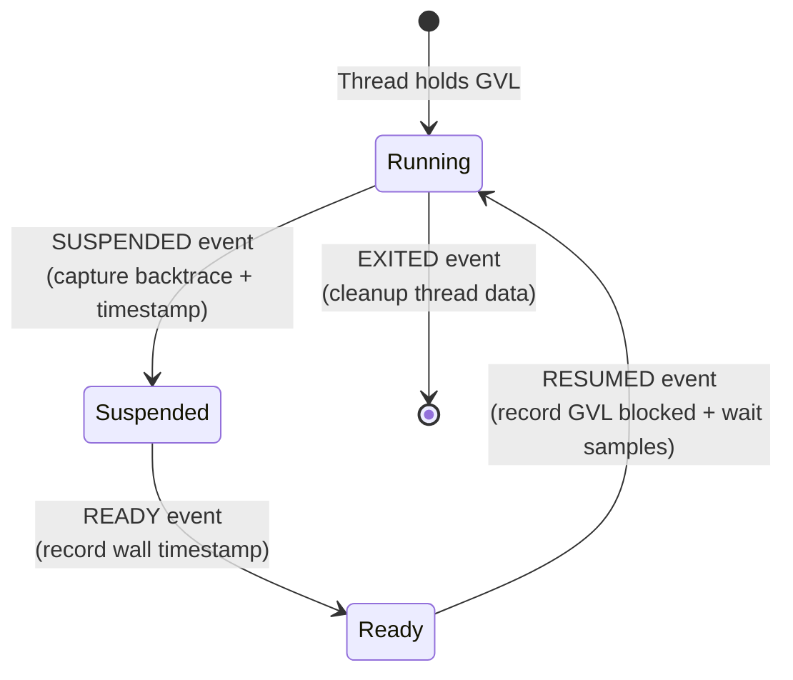

# Internals

This chapter describes how sperf works under the hood. Understanding the internals helps you interpret edge cases in profiling results and appreciate the design trade-offs.

## Architecture overview

sperf consists of a C extension and a Ruby wrapper:



## Global profiler state

sperf uses a single global `sperf_profiler_t` struct. Only one profiling session can be active at a time ([single session](#index:single session) limitation). The struct holds:

- Timer configuration (frequency, mode, signal number)
- Sample buffer (dynamically growing array)
- Frame pool (dynamically growing VALUE array)
- Thread-specific key for per-thread data
- GC phase tracking state
- Sampling overhead counters

## Timer implementation

sperf uses a timer to periodically trigger sampling. The timer implementation depends on the platform:

### Linux: Signal-based timer (default)

On Linux, sperf uses `timer_create` with `SIGEV_SIGNAL` to deliver a real-time signal (default: `SIGRTMIN+8`) at the configured frequency. A `sigaction` handler calls `rb_postponed_job_trigger` to schedule the sampling callback.



This approach provides precise timing (~1000us median interval at 1000Hz) with no extra thread.

### Fallback: nanosleep thread

On macOS, or when `signal: false` is set on Linux, sperf creates a dedicated pthread that loops with `nanosleep`:

```c
while (prof->running) {
    rb_postponed_job_trigger(prof->pj_handle);
    nanosleep(&interval, NULL);
}
```

This is simpler but has ~100us drift per tick due to nanosleep's imprecision.

## Sampling: current-thread-only

When the postponed job fires, `sperf_sample_job` runs on whatever thread currently holds the GVL. It only samples that thread using `rb_thread_current()`.

This is a deliberate design choice:

1. `rb_profile_frames` can only capture the current thread's stack
2. There's no need to iterate `Thread.list` — combined with GVL event hooks, sperf gets broad coverage of all threads (though a [known race](#known-limitations) in the Ruby VM can cause occasional missed samples)

The sampling callback:

1. Gets or creates per-thread data (`sperf_thread_data_t`)
2. Reads the current clock (`CLOCK_THREAD_CPUTIME_ID` for CPU mode, `CLOCK_MONOTONIC` for wall mode)
3. Computes weight as `time_now - prev_time`
4. Captures the backtrace with `rb_profile_frames` directly into the frame pool
5. Records the sample (frame start index, depth, weight, type)
6. Updates `prev_time`

## GVL event tracking (wall mode)

In wall mode, sperf hooks into Ruby's thread event API to track GVL transitions. This captures time that sampling alone would miss — time spent off the GVL.



### SUSPENDED

When a thread releases the GVL (e.g., before I/O):

1. Capture the current backtrace into the frame pool
2. Record a normal sample (time since last sample)
3. Save the backtrace and wall timestamp for later use

### READY

When a thread becomes ready to run (e.g., I/O completed):

1. Record the wall timestamp (no GVL needed — only simple C operations)

### RESUMED

When a thread reacquires the GVL:

1. Record a `[GVL blocked]` sample: weight = `ready_at - suspended_at` (off-GVL time)
2. Record a `[GVL wait]` sample: weight = `resumed_at - ready_at` (GVL contention time)
3. Both samples reuse the backtrace captured at SUSPENDED

This way, off-GVL time and GVL contention are accurately attributed to the code that triggered them, even though no timer-based sampling can occur while the thread is off the GVL.

## GC phase tracking

sperf hooks into Ruby's internal GC events to track garbage collection time:

| Event | Action |
|-------|--------|
| `GC_START` | Set phase to marking |
| `GC_END_MARK` | Set phase to sweeping |
| `GC_END_SWEEP` | Clear phase |
| `GC_ENTER` | Capture backtrace + wall timestamp |
| `GC_EXIT` | Record `[GC marking]` or `[GC sweeping]` sample |

GC samples always use wall time regardless of the profiling mode, because GC time is real elapsed time that affects application latency.

## Deferred string resolution

During sampling, sperf stores raw frame `VALUE`s (Ruby internal object references) in the [frame pool](#index:frame pool) — not strings. This [deferred string resolution](#index:deferred string resolution) keeps the hot path allocation-free and fast.

String resolution happens at stop time:

1. `Sperf.stop` calls `_c_stop` which returns raw data
2. For each frame VALUE, `rb_profile_frame_full_label` and `rb_profile_frame_path` are called to get human-readable strings
3. These strings are then passed to the Ruby encoders

This means sampling only writes integers (VALUE pointers and timestamps) to pre-allocated buffers. No Ruby objects are created, no GC pressure is added during profiling.

## Frame pool and GC safety

The frame pool is a contiguous array of `VALUE`s that stores raw frame references from `rb_profile_frames`. Since these are Ruby object references, they must be protected from garbage collection.

sperf wraps the profiler struct in a `TypedData` object with a custom `dmark` function that calls `rb_gc_mark_locations` on the entire frame pool. This tells the GC that all VALUEs in the pool are reachable and must not be collected.

The frame pool starts at ~1MB and doubles in size via `realloc` when needed. Similarly, the sample buffer starts with 1024 entries and grows by 2x.

## Per-thread data

Each thread gets a `sperf_thread_data_t` struct stored via Ruby's thread-specific data API (`rb_internal_thread_specific_set`). This tracks:

- `prev_cpu_ns`: Previous CPU time reading (for computing weight)
- `prev_wall_ns`: Previous wall time reading
- `suspended_at_ns`: Wall timestamp when thread was suspended
- `ready_at_ns`: Wall timestamp when thread became ready
- `suspended_frame_start`/`depth`: Saved backtrace from SUSPENDED event

Thread data is created lazily on first encounter and freed on the `EXITED` event or at profiler stop.

## Fork safety

sperf registers a `pthread_atfork` child handler that silently stops profiling in the forked child process ([fork safety](#index:fork safety)):

- Clears the timer/signal state
- Removes event hooks
- Frees sample and frame buffers

The parent process continues profiling unaffected. The child can start a fresh profiling session if needed.

## pprof encoder

sperf encodes the [pprof](#cite:ren2010) protobuf format entirely in Ruby, with no protobuf gem dependency. The encoder in `Sperf::PProf.encode`:

1. Builds a string table (index 0 is always the empty string)
2. Converts string frames to index frames and merges identical stacks
3. Builds location and function tables
4. Encodes the Profile protobuf message field by field

This hand-written encoder is simple (~100 lines) and only runs once at stop time, so performance is not a concern.

## Known limitations

### Running EC race

There is a known race condition in the Ruby VM where `rb_postponed_job_trigger` from the timer thread may set the interrupt flag on the wrong thread's execution context. This happens when a new thread's native thread starts before acquiring the GVL. The result is that timer samples may miss threads doing C busy-wait, with their CPU time leaking into the next SUSPENDED event's stack.

This is a Ruby VM bug, not a sperf bug, and affects all postponed-job-based profilers.

### Single session

Only one profiling session can be active at a time due to the global profiler state. Calling `Sperf.start` while already profiling is not supported.

### Method-level granularity

sperf profiles at the method level, not the line level. Frame labels use `rb_profile_frame_full_label` for qualified names (e.g., `Integer#times`, `MyClass#method_name`). Line numbers are not included.
