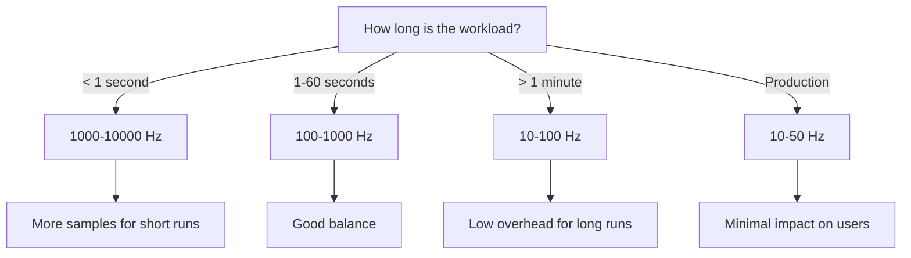
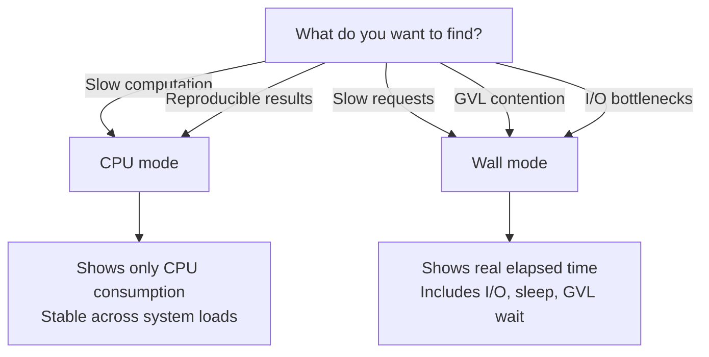

# Advanced Topics

## Understanding Sampling Overhead

sprof measures its own sampling overhead. When verbose mode is enabled, it reports:

```
[sprof] sampling: 523 calls, 4.21ms total, 8.1us/call avg
```

Each sampling callback (`sprof_sample_job`) is timed using `CLOCK_THREAD_CPUTIME_ID`. The overhead per sample is typically 5-15 microseconds, which at 100 Hz adds less than 0.1% overhead.

The overhead comes from:
- Reading the thread CPU clock (~1us)
- Calling `rb_profile_thread_frames` to capture the stack (~3-10us depending on depth)
- Writing the sample to the buffer (~0.1us)

No memory allocation happens during sampling. Frame pool and sample buffer are pre-allocated and grow via `realloc` only when capacity is exceeded.

## Memory Usage

sprof pre-allocates two buffers:

| Buffer | Initial Size | Growth |
|--------|-------------|--------|
| Sample buffer | 1024 entries (~40 KB) | 2x on demand |
| Frame pool | ~131K frames (~1 MB) | 2x on demand |

For a typical profiling session at 100 Hz for 60 seconds, the sample buffer holds ~6000 entries (~240 KB) and the frame pool holds ~600K frames (~5 MB). Memory is freed when `Sprof.stop` is called.

## Thread Safety and Limitations

### Single Session

Only one profiling session can be active at a time. The profiler uses a single global `sprof_profiler_t` structure. Attempting to start a second session raises `RuntimeError`.

### Thread Creation During Profiling

Threads created during profiling are automatically tracked. Per-thread data is created on the first GVL event (RESUMED or SUSPENDED) or the first timer sample. The first sample for each new thread is skipped because there is no previous timestamp to compute a delta from.

### Thread Exit

Thread cleanup is handled by `RUBY_INTERNAL_THREAD_EVENT_EXITED`. When a thread exits, its per-thread data is freed. At stop time, all remaining threads' data is also cleaned up.

### Session Restart

When you stop and restart profiling, all per-thread state is cleared. Threads that survive across sessions get fresh `sprof_thread_data_t` on their first event in the new session. This prevents stale timestamps from the previous session from creating artificially large weight values.

## Frequency Selection Guide



With time-delta weighting, **accuracy does not depend on frequency**. Lower frequencies produce fewer samples but each sample carries proportionally more weight. The total time is always correctly distributed. Higher frequencies provide:

- More statistical samples for variance reduction
- Better resolution for short-lived methods
- Slightly higher overhead

## CPU Mode vs Wall Mode Decision Guide



### CPU Mode Details

- Uses per-thread `clock_gettime` with thread-specific clock IDs
- Results are independent of system load -- other processes don't affect measurements
- Sleep, I/O, and GVL waits are invisible (zero CPU time consumed)
- Ideal for finding algorithmic bottlenecks and CPU-intensive code

### Wall Mode Details

- Uses `CLOCK_MONOTONIC` for consistent timestamps
- Captures everything: CPU time, I/O wait, sleep, GVL contention
- Affected by system load -- busy-wait methods take longer under contention
- Shows `[GVL blocked]` and `[GVL wait]` synthetic frames
- Ideal for understanding end-to-end latency

## Known Issues

### running_ec Race in Ruby VM

There is a known race condition in the Ruby VM where `rb_postponed_job_trigger` from the timer thread may set the interrupt flag on the wrong thread's execution context. This happens when a new thread's native thread starts (calling `ruby_thread_set_native`) before it acquires the GVL.

The effect is that timer samples may miss threads performing C busy-wait operations, with their CPU time leaking into the next SUSPENDED event's stack. This is tracked as a Ruby VM bug and is mitigated by sprof's GVL event hooks, which capture samples at SUSPENDED events.

### Method-Level Profiling

sprof profiles at the method level, not the line level. Frame labels use `rb_profile_frame_full_label` for qualified names (e.g., `Integer#times`, `MyClass#my_method`). Line numbers are not recorded.

This is a deliberate design choice: method-level profiling keeps the frame representation compact and avoids the complexity of mapping bytecode offsets to source lines during sampling.

### Single GC State

GC phase tracking uses a single global state (`gc_phase`). If GC runs concurrently on multiple threads (which doesn't happen in current CRuby due to the GVL), the phase tracking could be inaccurate. This is not an issue in practice.

## Integrating with CI/CD

sprof profiles can be used in CI to detect performance regressions:

```ruby
# test/performance_test.rb
require "sprof"
require "minitest/autorun"

class PerformanceTest < Minitest::Test
  def test_no_regression
    data = Sprof.start(frequency: 1000, mode: :cpu) do
      MyApp.process(fixture_input)
    end

    total_ms = data[:samples].sum { |_, w| w } / 1_000_000.0

    # Fail if total CPU time exceeds budget
    assert total_ms < 500, "CPU time #{total_ms.round(1)}ms exceeds 500ms budget"
  end
end
```

Save profiles as CI artifacts for comparison:

```bash
sprof -o "profile-${CI_COMMIT_SHA}.pb.gz" exec ruby benchmark.rb
```

## Profiling Ractors

sprof is designed for traditional Ruby threads. Ractor support depends on how Ractors interact with the GVL event hooks and postponed job mechanism. As Ractors mature in future Ruby versions, sprof's compatibility may need updates.

> [!CAUTION]
> Using sprof with Ractors is currently untested. The single global profiler structure and GVL-based sampling model may not correctly handle multiple Ractor contexts.
