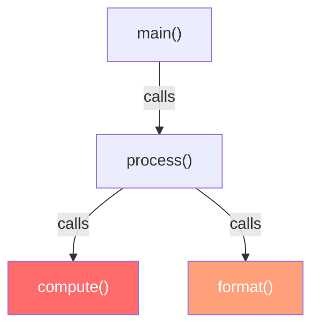

# Interpreting Results

## Flat vs. cumulative time

Understanding the difference between flat and cumulative time is essential for effective profiling, as described in classic profiling literature [gprof](#cite:graham1982).

- **[Flat time](#index:flat time)**: Time attributed directly to a function — it was the leaf (deepest frame) in the sample. High flat time means the function itself is doing expensive work.
- **[Cumulative time](#index:cumulative time)**: Time for all samples where the function appears anywhere in the stack. High cumulative time means the function (or something it calls) is expensive.



If `compute()` has high flat time, optimize `compute()` itself. If `process()` has high cumulative but low flat time, the cost is in its children (`compute()` and `format()`).

## Weight unit

All weights in rperf are in **nanoseconds**, regardless of profiling mode:

- 1,000 ns = 1 us (microsecond)
- 1,000,000 ns = 1 ms (millisecond)
- 1,000,000,000 ns = 1 s (second)

## VM state labels

In addition to normal Ruby frames, rperf tracks non-CPU activity as **labels** (tags) on samples. The C extension records a `vm_state` for each sample, and Ruby converts these to labels with keys `%GVL` and `%GC` before encoding. These labels appear in `label_sets` alongside user labels (like `endpoint`), and can be filtered with the viewer's tagfocus, tagroot, and tagleaf controls.

### %GVL: blocked

**Mode**: wall only

Time the thread spent off the GVL — during I/O operations, `sleep`, or C extensions that release the [GVL](#index:GVL). This time is attributed to the stack captured at the SUSPENDED event (when the thread released the GVL).

High `%GVL: blocked` time indicates your program is I/O bound. Look at the cumulative view to find which functions are triggering the I/O.

In the viewer, use tagfocus with `blocked` to isolate these samples, or tagroot with `%GVL` to group by GVL state.

### %GVL: wait

**Mode**: wall only

Time the thread spent waiting to reacquire the GVL after becoming ready. This indicates GVL contention — another thread is holding the GVL while this thread wants to run.

High `%GVL: wait` time means your threads are serialized on the GVL. Consider reducing GVL-holding work, using Ractors, or moving work to child processes.

In the viewer, use tagfocus with `wait` to isolate these samples.

### %GC: mark

**Mode**: cpu and wall

Time spent in the GC marking phase. Always measured in wall time. Attributed to the stack that triggered GC.

High `%GC: mark` time means too many live objects. Reduce the number of long-lived allocations.

### %GC: sweep

**Mode**: cpu and wall

Time spent in the GC sweeping phase. Always measured in wall time. Attributed to the stack that triggered GC.

High `%GC: sweep` time means too many short-lived objects. Consider reusing objects or using object pools.

### Filtering VM state labels

In the rperf viewer or `Rperf::Viewer`:

- **tagfocus**: Enter `blocked`, `wait`, `mark`, or `sweep` to isolate specific VM states
- **tagignore**: Check `%GVL: blocked` to exclude off-GVL samples
- **tagroot**: Check `%GVL` or `%GC` to group the flamegraph by VM state

When using pprof format, `go tool pprof -tagfocus=%GVL=blocked profile.pb.gz` and similar flags provide equivalent filtering.

## Diagnosing common problems

### High CPU usage

**Mode**: cpu

Look for functions with high flat CPU time. These are the functions consuming CPU cycles.

**Action**: Optimize the hot function (better algorithm, caching) or call it less frequently.

### Slow requests / high latency

**Mode**: wall

Look for functions with high cumulative wall time.

- If `%GVL: blocked` time is dominant: I/O or sleep is the bottleneck. Check database queries, HTTP calls, file I/O.
- If `%GVL: wait` time is dominant: GVL contention. Reduce GVL-holding work or move to Ractors/child processes.

### GC pressure

**Mode**: cpu or wall

Look for samples with `%GC: mark` and `%GC: sweep` labels.

- High `%GC: mark` time: Too many live objects. Reduce allocations of long-lived objects.
- High `%GC: sweep` time: Too many short-lived objects. Reuse or pool objects.

The `rperf stat` output also shows GC counts and allocated/freed object counts, which can help diagnose allocation-heavy code.

### Multithreaded app slower than expected

**Mode**: wall

Look for `%GVL: wait` time across threads.

```bash
rperf stat ruby threaded_app.rb
```

Example output for a GVL-contended workload:

```
 Performance stats for 'ruby threaded_app.rb':

            89.9 ms   user
            14.0 ms   sys
            41.2 ms   real

             0.5 ms   1.2%  [Rperf] CPU execution
             9.8 ms  23.8%  [Rperf] GVL blocked (I/O, sleep)
            30.8 ms  75.0%  [Rperf] GVL wait (contention)
```

Here, 75% of wall time is GVL contention. The four threads are fighting for the GVL, serializing their CPU work.

## Tips for effective profiling

- **Default frequency (1000 Hz) works well** for most cases. For long-running production profiling, 100-500 Hz reduces overhead further.
- **Profile representative workloads**, not micro-benchmarks. Profiling a real request or batch job gives more actionable results than profiling a tight loop.
- **Compare cpu and wall profiles** to distinguish CPU-bound from I/O-bound code. If a function is hot in wall mode but not in CPU mode, it's blocked on I/O.
- **Use `rperf diff`** to measure the impact of optimizations. Profile before and after, then compare.
- **Use the verbose flag** (`-v`) to check profiler overhead and see top functions immediately.
