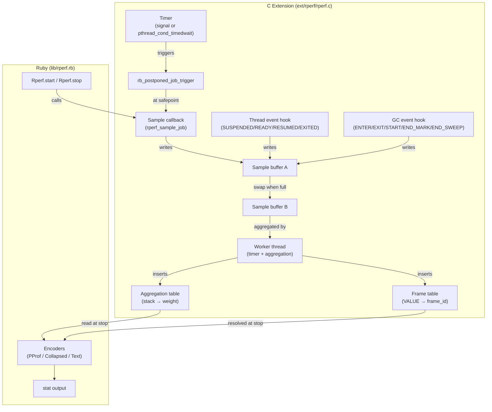

# Architecture Overview

This chapter describes rperf's high-level architecture and the core data structures that underpin profiling. Understanding these internals helps you interpret edge cases in profiling results and appreciate the design trade-offs.

## System diagram

rperf consists of a C extension and a Ruby wrapper:

The C extension handles all performance-critical operations: timer management, sample recording, and aggregation. The Ruby layer provides the user-facing API, output encoding, and statistics formatting.

## Global profiler state

rperf uses a single global `rperf_profiler_t` struct. Only one profiling session can be active at a time ([single session](#index:single session) limitation). The struct holds:

- Timer configuration (frequency, mode, signal number)
- Double-buffered sample storage (two sample buffers + frame pools, swapped when full)
- Frame table (VALUE → uint32 frame_id, deduplicates frame references)
- Aggregation table (unique stack → accumulated weight)
- Worker thread handle (unified timer + aggregation thread)
- Thread-specific key for per-thread data
- GC phase tracking state
- Sampling overhead counters

## Per-thread data

Each thread gets a `rperf_thread_data_t` struct stored via Ruby's thread-specific data API (`rb_internal_thread_specific_set`). This tracks:

- `prev_time_ns`: Previous time reading (for computing weight)
- `prev_wall_ns`: Previous wall time reading
- `suspended_at_ns`: Wall timestamp when thread was suspended
- `ready_at_ns`: Wall timestamp when thread became ready
- (Backtrace is not saved at SUSPENDED; it is re-captured at RESUMED)
- `label_set_id`: Current label set ID (0 = no labels)

Thread data is created lazily on first encounter and freed on the `EXITED` event or at profiler stop.

## GC safety

Frame VALUEs must be protected from garbage collection. rperf wraps the profiler struct in a `TypedData` object with a custom `dmark` function that marks three regions:

1. **Both frame pools** (active and standby buffers)
2. **Frame table keys** (unique frame VALUEs)

The frame table keys array starts at 4,096 entries and grows by 2× when full. Growth allocates a new array, copies existing data, and swaps the pointer atomically (`memory_order_release`). The old array is kept alive until `stop` to prevent use-after-free if GC's mark phase is reading it concurrently. The `dmark` function loads the keys pointer with `memory_order_acquire` and the count with `memory_order_acquire` to ensure a consistent view.

## Fork safety and multi-process profiling

### Fork safety (C level)

rperf registers a `pthread_atfork` child handler that silently stops profiling in the forked child process ([fork safety](#index:fork safety)):

- Clears the timer/signal state
- Re-initializes mutex/condvar (may have been locked by parent's worker thread at fork time)
- Removes event hooks (thread events, GC events)
- Frees sample buffers, frame table, and aggregation table
- Resets GC state, stats, and profile refcount

The parent process continues profiling unaffected. The child can start a fresh profiling session if needed.

### Multi-process profiling (Ruby level)

When [multi-process profiling](#index:multi-process profiling) is enabled (the default for CLI usage), rperf uses Ruby's `Process._fork` hook (available since Ruby 3.1) to automatically restart profiling in forked child processes. The flow is:

1. **Before fork**: The `_fork` hook creates a [session directory](#index:session directory) (once, on first fork) for collecting per-process profiles. The root process's output is redirected to the session directory.
2. **In child**: After `pthread_atfork` cleans up C state, `_restart_in_child` starts a new profiling session with output directed to the session directory. A `%pid` label is set for per-process identification.
3. **On child exit**: The inherited `at_exit` hook calls `Rperf.stop`, writing the child's profile to the session directory as a `.json.gz` file.
4. **On root exit**: The root writes its own profile, then aggregates all `.json.gz` files in the session directory into a single merged output (stat report or file). The session directory is then deleted.

For spawned children (`spawn`, `system`), the child inherits `RUBYOPT=-rrperf` and environment variables (`RPERF_SESSION_DIR`, `RPERF_ROOT_PROCESS`). When the child Ruby process loads rperf, the auto-start block detects it is not the root process and writes its profile directly to the session directory.

### Session directory

The session directory is created under `$RPERF_TMPDIR`, `$XDG_RUNTIME_DIR`, or the system temp directory (in that priority order), inside a per-user subdirectory (`rperf-$UID/`, mode 0700). Each session gets a unique directory name: `rperf-$PID-$RANDOM`.

Stale session directories from crashed processes are cleaned up automatically: when a new CLI session starts, it checks for session directories whose root PID is no longer alive and removes them.

### Label merging

When aggregating profiles from multiple processes, [label sets](#index:label set) are remapped to ensure consistency. If two child processes use the same label values (e.g., both have `endpoint: "GET /users"`), they share the same label set ID in the merged output. The `%pid` label ensures samples from different processes remain distinguishable even after merging.

## Known limitations

### Running EC race

There is a known race condition in the Ruby VM where `rb_postponed_job_trigger` from the timer thread may set the interrupt flag on the wrong thread's execution context. This happens when a new thread's native thread starts before acquiring the GVL. The result is that timer samples may miss threads doing C busy-wait, with their CPU time leaking into the next SUSPENDED event's stack.

This is a Ruby VM bug, not a rperf bug, and affects all postponed-job-based profilers.

However, rperf mitigates this on Linux by using `SIGEV_THREAD_ID` to deliver the timer signal exclusively to the dedicated worker thread, rather than to an arbitrary Ruby thread. Since the worker thread calls `rb_postponed_job_trigger` itself — rather than having a signal handler fire on a Ruby thread that may have a stale `running_ec` — the race window is significantly narrower. The nanosleep fallback (macOS and `signal: false`) behaves similarly, as the worker thread is the sole caller of `rb_postponed_job_trigger`.

### Single session

Only one profiling session can be active at a time due to the global profiler state. Calling `Rperf.start` while already profiling is not supported.

### Method-level granularity

rperf profiles at the method level, not the line level. Frame labels use `rb_profile_frame_full_label` for qualified names (e.g., `Integer#times`, `MyClass#method_name`). Line numbers are not included.
