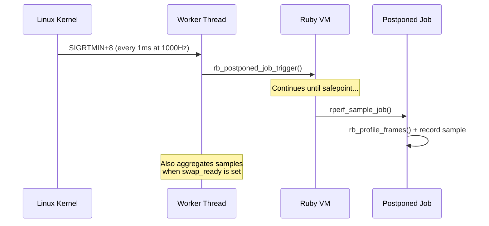
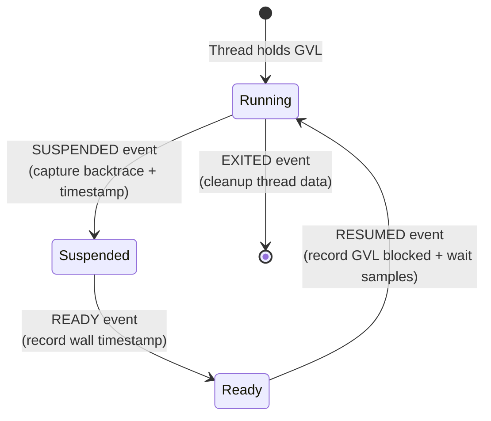

# Sampling

This chapter explains how rperf collects samples: the timer mechanism that triggers sampling, the sampling callback itself, and the event hooks that capture GVL and GC activity.

## Timer and worker thread

rperf uses a single worker thread that handles both timer triggering and periodic sample aggregation. The timer mechanism depends on the platform.

### Linux: Signal-based timer (default)

On Linux, rperf uses `timer_create` with `SIGEV_THREAD_ID` to deliver a real-time signal (default: `SIGRTMIN+8`) exclusively to the worker thread at the configured frequency. The signal handler calls `rb_postponed_job_trigger` to schedule the sampling callback.

Using `SIGEV_THREAD_ID` ensures the timer signal only targets the worker thread, preventing it from interrupting `nanosleep`, `read`, or other blocking syscalls in Ruby threads (e.g., inside `rb_thread_call_without_gvl`).

This approach provides precise timing (~1000us median interval at 1000Hz).

### Fallback: pthread_cond_timedwait

On macOS, or when `signal: false` is set on Linux, the worker thread uses `pthread_cond_timedwait` with an absolute deadline as the timer:

- **Timeout** (deadline reached): trigger `rb_postponed_job_trigger` and advance deadline
- **Signal** (swap_ready set): aggregate the standby buffer immediately

The deadline-based approach avoids drift when aggregation takes time. This mode has ~100us timing imprecision compared to the signal-based approach.

## Sampling callback

When the postponed job fires, `rperf_sample_job` runs on whatever thread currently holds the GVL. It only samples that thread using `rb_thread_current()`.

This is a deliberate design choice:

1. `rb_profile_frames` can only capture the current thread's stack
2. There's no need to iterate `Thread.list` — combined with GVL event hooks, rperf gets broad coverage of all threads (though a [known race](08-architecture.md#running-ec-race) in the Ruby VM can cause occasional missed samples)

The sampling callback:

1. Gets or creates per-thread data (`rperf_thread_data_t`)
2. Reads the current clock (`CLOCK_THREAD_CPUTIME_ID` for CPU mode, `CLOCK_MONOTONIC` for wall mode)
3. Computes weight as `time_now - prev_time`
4. Captures the backtrace with `rb_profile_frames` directly into the frame pool
5. Records the sample (frame start index, depth, weight, type)
6. Updates `prev_time`

## GVL event tracking (wall mode)

In wall mode, rperf hooks into Ruby's thread event API to track GVL transitions. This captures time that sampling alone would miss — time spent off the GVL.

### SUSPENDED

When a thread releases the GVL (e.g., before I/O):

1. Capture the current backtrace into the frame pool
2. Record a normal sample (time since last sample)
3. Save the backtrace and wall timestamp for later use

### READY

When a thread becomes ready to run (e.g., I/O completed):

1. Record the wall timestamp (no GVL needed — only simple C operations)

### RESUMED

When a thread reacquires the GVL:

1. Record a sample with `vm_state = GVL_BLOCKED`: weight = `ready_at - suspended_at` (off-GVL time)
2. Record a sample with `vm_state = GVL_WAIT`: weight = `resumed_at - ready_at` (GVL contention time)
3. Both samples reuse the backtrace captured at SUSPENDED

These `vm_state` values are later converted to labels (`%GVL: blocked` and `%GVL: wait`) by the Ruby layer at encoding time. This way, off-GVL time and GVL contention are accurately attributed to the code that triggered them, even though no timer-based sampling can occur while the thread is off the GVL.

## GC phase tracking

rperf hooks into Ruby's internal GC events to track garbage collection time:

| Event | Action |
|-------|--------|
| `GC_START` | Set phase to marking |
| `GC_END_MARK` | Set phase to sweeping |
| `GC_END_SWEEP` | Clear phase |
| `GC_ENTER` | Capture backtrace + wall timestamp |
| `GC_EXIT` | Record sample with `vm_state = GC_MARK` or `vm_state = GC_SWEEP` |

GC samples always use wall time regardless of the profiling mode, because GC time is real elapsed time that affects application latency.

## Deferred string resolution

During sampling, rperf stores raw frame `VALUE`s (Ruby internal object references) in the frame pool — not strings. This [deferred string resolution](#index:deferred string resolution) keeps the hot path allocation-free and fast.

String resolution happens at stop time:

1. `Rperf.stop` calls `_c_stop`
2. The frame table maps each unique frame VALUE to a `[path, label]` string pair via `rb_profile_frame_full_label` and `rb_profile_frame_path`
3. These resolved strings are passed to the Ruby encoders

This means sampling only writes integers (VALUE pointers and timestamps) to pre-allocated buffers. No Ruby objects are created, no GC pressure is added during profiling.
