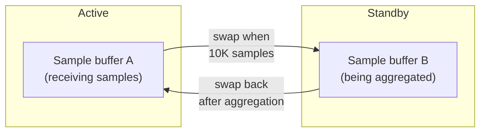

# Aggregation

This chapter explains how rperf processes raw samples into compact, deduplicated data structures. Aggregation keeps memory usage bounded during long profiling sessions.

## Overview

By default (`aggregate: true`), rperf periodically aggregates samples in the background. Raw samples — each containing a stack trace, weight, and metadata — are merged into two hash tables: a frame table and an aggregation table. Identical stacks are combined by summing their weights.

## Double buffering

Two sample buffers alternate roles to allow concurrent sampling and aggregation:

1. The **active buffer** receives new samples from sampling callbacks
2. When the active buffer reaches 10,000 samples, the buffers swap
3. The **standby buffer** is processed by the worker thread in the background

If the worker thread hasn't finished processing the standby buffer, the swap is skipped and the active buffer continues growing (fallback to unbounded mode).

Each buffer has its own frame pool. The active buffer's frame pool receives raw `VALUE` references from `rb_profile_frames`. When buffers swap, the standby buffer's frame pool is processed and then cleared for reuse.

## Frame table

The frame table (`VALUE → uint32_t frame_id`) deduplicates frame references. Each unique frame VALUE gets a small integer ID.

- Keys: raw frame VALUEs (the only GC mark target for aggregated data)
- Values: compact uint32_t IDs used in the aggregation table
- Initial capacity: 4,096 entries, grows by 2× when full
- Growth uses atomic pointer swaps for GC dmark safety (see [GC safety](08-architecture.md#gc-safety))

Using uint32_t frame IDs instead of full VALUEs halves the memory needed for stack storage in the aggregation table.

## Aggregation table

The aggregation table merges identical stacks by summing their weights:

- **Key**: `(frame_ids[], thread_seq, label_set_id, vm_state)` — the stack (as frame IDs), thread sequence number, label set, and VM state
- **Value**: accumulated weight in nanoseconds

Frame IDs are stored contiguously in a separate stack pool. Each aggregation table entry points into this pool (start index + depth).

The `vm_state` field records the VM activity at sample time (e.g., `GVL_BLOCKED`, `GVL_WAIT`, `GC_MARK`, `GC_SWEEP`, or `NORMAL`). It is part of the aggregation key so that samples with the same stack but different VM states are kept separate. At encoding time, the Ruby layer converts `vm_state` to labels (`%GVL` and `%GC`) via `merge_vm_state_labels!`.

The `label_set_id` is also part of the key, so samples with the same stack but different user labels are kept separate.

## Memory usage

| Buffer | Initial size | Element size | Initial memory |
|--------|-------------|-------------|----------------|
| Sample buffer (×2) | 16,384 | 32B | 512KB × 2 |
| Frame pool (×2) | 131,072 | 8B (VALUE) | 1MB × 2 |
| Frame table keys | 4,096 | 8B (VALUE) | 32KB |
| Frame table buckets | 8,192 | 4B (uint32) | 32KB |
| Agg table buckets | 2,048 | 28B | 56KB |
| Stack pool | 4,096 | 4B (uint32) | 16KB |

Total: ~3.6MB with `aggregate: true`, ~1.5MB with `aggregate: false` (single buffer only). Frame table and aggregation table grow dynamically as needed.

With aggregation enabled, memory usage stays roughly constant regardless of profiling duration — only the number of unique stacks matters, not the total number of samples collected.
