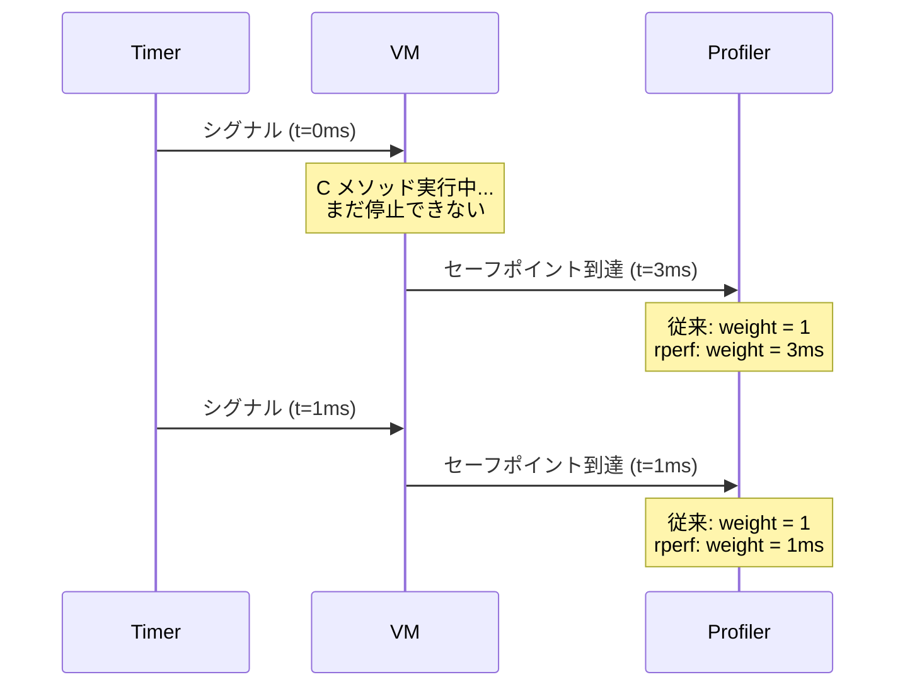

# イントロダクション

## rperf とは？

[rperf](#index) は、[セーフポイント](#index:safepoint)ベースの[サンプリング](#index:sampling)性能プロファイラです。Ruby プログラムがどこで時間を使っているかを特定します。CPU 計算、I/O 待ち、[GVL](#index:GVL) 競合、ガベージコレクションのいずれであっても対応できます。

従来のサンプリングプロファイラがサンプルを均等にカウントするのに対し、rperf は各サンプルの[重み](#index:weight)として実際の時間差分（ナノ秒単位）を使用します。これにより、[postponed job](#index:postponed job) ベースのサンプリングに固有の[セーフポイントバイアス](#index:safepoint bias)問題を補正し、より正確な結果を生成します。

rperf は Linux の [perf](#cite:demelo2010) に着想を得ており、`record`、`stat`、`report` などのサブコマンドを持つ馴染みのある CLI インターフェースを提供します。

### 利点

- **正確なプロファイリング**: 時間差分重み付けが[セーフポイントバイアス](#index:safepoint bias)を補正し、従来のカウントベースのプロファイラよりも実際の時間分布に近い結果を生成します。
- **GVL / GC の可視化**: wall モードでは、GVL 外のブロッキング、GVL 競合、GC marking/sweeping をサンプルラベル（`%GVL`、`%GC`）として追跡します。別途ツールは不要です。
- **標準出力形式**: [pprof](#index:pprof) protobuf（`go tool pprof` と互換）、[collapsed stacks](#index:collapsed stacks)（フレームグラフ / speedscope 向け）、人間が読めるテキスト形式で出力します。
- **低オーバーヘッド**: デフォルト 1000 Hz でのサンプリングコールバックコストは < 0.2% で、本番環境での使用に適しています。
- **シンプルな CLI**: `rperf stat` で概要を素早く確認し、`rperf record` + `rperf report` で詳細な分析が可能です。

### 制限事項

- **Ruby 3.4 以降のみ**: Ruby 3.4 で導入された API を必要とします。
- **POSIX のみ**: Linux と macOS。Windows はサポートされていません。
- **メソッドレベルの粒度**: 行番号の解像度はありません。プロファイルはメソッド名のみを表示します。
- **単一セッション**: C 拡張のグローバル状態のため、同時に 1 つのプロファイリングセッションのみ有効です。
- **セーフポイントレイテンシ**: サンプルは依然としてセーフポイントまで遅延されます。時間差分重み付けは*バイアス*を補正しますが、正確な中断された命令ポインタは復元できません。

## なぜ別のプロファイラが必要なのか？

Ruby には [stackprof](#cite:stackprof) などのプロファイリングツールが既にあります。では、なぜ rperf が必要なのでしょうか？

### セーフポイントバイアス問題

多くの Ruby サンプリングプロファイラは、シグナルハンドラ内で直接 `rb_profile_frames` を呼び出してバックトレースを収集します。このアプローチはシグナルの実際のタイミングでバックトレースを取得できますが、文書化されていない VM 内部の状態に依存しています。`rb_profile_frames` は async-signal-safe であることが保証されておらず、VM が内部構造を更新中の場合、結果が不正確になる可能性があります。

rperf は異なるアプローチを取ります。シグナルハンドラから安全に処理を遅延させるための Ruby VM の公式 API である [postponed job](#index:postponed job) メカニズム（`rb_postponed_job`）を使用します。バックトレースの収集は次の[セーフポイント](#index:safepoint)まで遅延されます。セーフポイントとは、VM が一貫した状態にあり、`rb_profile_frames` が信頼性の高い結果を返せるポイントです。タイマーがセーフポイント間で発火した場合、実際のサンプルは次のセーフポイントまで遅延されるというトレードオフがあります。

各サンプルが均等にカウントされる場合（重み = 1）、長時間実行される C メソッドによって遅延されたサンプルは、即座に取得されたサンプルと同じ重みを持つことになります。これが[セーフポイントバイアス](#cite:mytkowicz2010)問題です。スレッドがセーフポイントに到達したときに実行中の関数がそうでない場合よりも多く出現し、セーフポイント間の関数は過小評価されます。



rperf は各サンプルの重みとして `clock_now - clock_prev` を記録することでこの問題を解決します。3ms 遅延されたサンプルは 1ms のサンプルの 3 倍の重みを持ち、実際に時間が費やされた場所を正確に反映します。

### その他の利点

- **GVL と GC の認識**: wall モードでは、rperf は GVL 外でのブロック時間、GVL の再取得待ち時間、GC の marking/sweeping フェーズの時間を、サンプルラベル（`%GVL=blocked`/`wait`、`%GC=mark`/`sweep`）として追跡します。これらはユーザーラベルと同様に `label_sets` に格納され、pprof で `-tagfocus` 等を使ってフィルタリングできます。
- **perf ライクな CLI**: [`rperf stat`](#index:rperf stat) コマンドで性能の概要を素早く確認でき（`perf stat` のように）、[`rperf record`](#index:rperf record) + [`rperf report`](#index:rperf report) で詳細なプロファイリングが可能です。
- **標準出力**: rperf は [pprof](#index:pprof) protobuf 形式で出力し、Go の `pprof` ツールエコシステムと互換性があります。[フレームグラフ](#cite:gregg2016)や speedscope 向けの [collapsed stacks](#index:collapsed stacks) 形式もサポートしています。
- **低オーバーヘッド**: デフォルト 1000 Hz でのサンプリングコールバックコストは < 0.2% で、本番環境での使用に適しています。

## 要件

- Ruby >= 3.4.0
- POSIX システム (Linux または macOS)
- Go (オプション、`rperf report` および `rperf diff` サブコマンド用)

## クイックスタート

Ruby スクリプトをプロファイルして結果を表示:

```bash
# rperf をインストール
gem install rperf

# 性能の概要を表示
rperf stat ruby my_app.rb

# プロファイルを記録してインタラクティブに表示
rperf record ruby my_app.rb
rperf report
```

Ruby コードから rperf を使用する場合:

```ruby
require "rperf"

Rperf.start(output: "profile.pb.gz") do
  # プロファイルしたいコード
end
```
