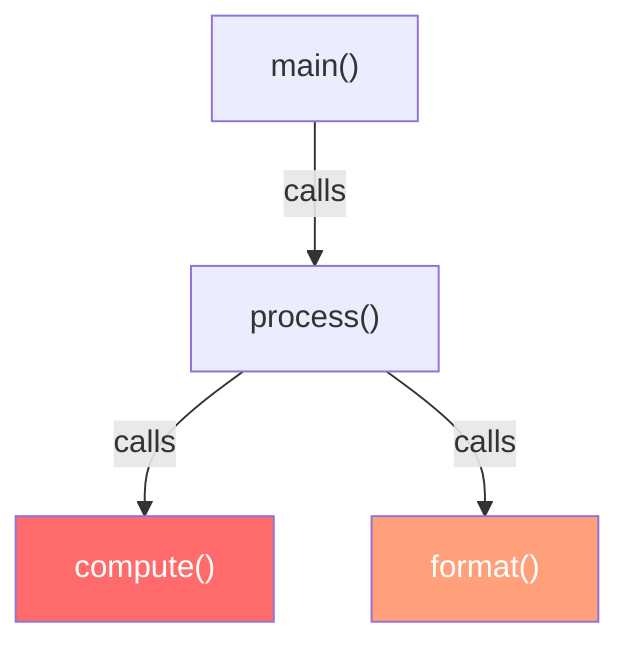

# 結果の解釈

## フラットタイムとキュムレイティブタイム

フラットタイムとキュムレイティブタイムの違いを理解することは、効果的なプロファイリングに不可欠です。これは古典的なプロファイリング文献 [gprof](#cite:graham1982) でも述べられています。

- **[フラットタイム](#index:flat time)**: 関数に直接帰属する時間 — サンプル内でリーフ（最深部のフレーム）だった時間です。フラットタイムが高い場合、その関数自体が高コストな処理を行っています。
- **[キュムレイティブタイム](#index:cumulative time)**: 関数がスタックのどこかに出現するすべてのサンプルの時間です。キュムレイティブタイムが高い場合、その関数（またはそれが呼び出すもの）が高コストです。



`compute()` のフラットタイムが高い場合、`compute()` 自体を最適化します。`process()` のキュムレイティブタイムが高くフラットタイムが低い場合、コストはその子関数（`compute()` と `format()`）にあります。

## 重みの単位

rperf のすべての重みは、プロファイリングモードに関係なく**ナノ秒**です:

- 1,000 ns = 1 us (マイクロ秒)
- 1,000,000 ns = 1 ms (ミリ秒)
- 1,000,000,000 ns = 1 s (秒)

## VM 状態ラベル

通常のユーザー定義ラベルに加えて、rperf は GVL や GC の状態を表す特別なラベルをサンプルに付与します。これらは合成フレームではなく、`label_sets` に格納されるラベルです。pprof の `-tagfocus`、`-tagroot`、`-tagleaf` でフィルタリングやグループ化が可能です。

C 拡張は各サンプルに `vm_state` を記録し、Ruby の `Rperf.stop` で `merge_vm_state_labels!` によってラベルに変換されます。

### %GVL=blocked

**モード**: wall のみ

スレッドが GVL の外にいた時間 — I/O 操作、`sleep`、[GVL](#index:GVL) を解放する C 拡張の実行中。サンプルには `%GVL` キーに `blocked` の値を持つラベルが付与されます。この時間は SUSPENDED イベント（スレッドが GVL を解放した時点）でキャプチャされたスタックに帰属されます。

`%GVL=blocked` のサンプルが多い場合、プログラムは I/O バウンドです。キュムレイティブビューで I/O をトリガーしている関数を確認してください。

```bash
# GVL blocked のサンプルのみを表示
go tool pprof -tagfocus=%GVL=blocked profile.pb.gz
```

### %GVL=wait

**モード**: wall のみ

スレッドが準備完了後に GVL を再取得するまで待った時間。これは GVL 競合を示します。別のスレッドがこのスレッドの実行を妨げて GVL を保持しています。

`%GVL=wait` のサンプルが多い場合、スレッドが GVL 上でシリアライズされています。GVL を保持する処理を減らすか、Ractor を使用するか、子プロセスに処理を移動することを検討してください。

```bash
# GVL 競合のサンプルのみを表示
go tool pprof -tagfocus=%GVL=wait profile.pb.gz
```

### %GC=mark

**モード**: cpu および wall

GC の marking フェーズに費やされた時間。常に wall time で計測されます。GC をトリガーしたスタックに帰属されます。

`%GC=mark` のサンプルが多い場合、生存オブジェクトが多すぎます。長寿命のアロケーションを減らしてください。

### %GC=sweep

**モード**: cpu および wall

GC の sweeping フェーズに費やされた時間。常に wall time で計測されます。GC をトリガーしたスタックに帰属されます。

`%GC=sweep` のサンプルが多い場合、短寿命のオブジェクトが多すぎます。オブジェクトの再利用やオブジェクトプールの使用を検討してください。

```bash
# GC 関連のサンプルを表示
go tool pprof -tagfocus=%GC profile.pb.gz

# GC フェーズごとにグループ化
go tool pprof -tagroot=%GC profile.pb.gz
```

## よくある問題の診断

### 高い CPU 使用率

**モード**: cpu

フラット CPU 時間が高い関数を探します。これらが CPU サイクルを消費している関数です。

**対策**: ホットな関数を最適化するか（より良いアルゴリズム、キャッシュ）、呼び出し頻度を減らします。

### 遅いリクエスト / 高レイテンシ

**モード**: wall

キュムレイティブな wall time が高い関数を探します。

- `%GVL=blocked` が支配的な場合: I/O または sleep がボトルネックです。データベースクエリ、HTTP 呼び出し、ファイル I/O を確認してください。
- `%GVL=wait` が支配的な場合: GVL 競合です。GVL を保持する処理を減らすか、Ractor/子プロセスに移行してください。

### GC プレッシャー

**モード**: cpu または wall

`%GC=mark` と `%GC=sweep` のサンプルを探します。

- `%GC=mark` が多い場合: 生存オブジェクトが多すぎます。長寿命オブジェクトのアロケーションを減らしてください。
- `%GC=sweep` が多い場合: 短寿命オブジェクトが多すぎます。オブジェクトの再利用やプーリングを行ってください。

`rperf stat` の出力には GC 回数やアロケーション済み/解放済みオブジェクト数も表示されるため、アロケーションの多いコードの診断に役立ちます。

### マルチスレッドアプリが想定より遅い

**モード**: wall

スレッド間の `%GVL=wait` ラベルを持つサンプルの時間を探します。

```bash
rperf stat ruby threaded_app.rb
```

GVL 競合が発生しているワークロードの出力例:

```
 Performance stats for 'ruby threaded_app.rb':

            89.9 ms   user
            14.0 ms   sys
            41.2 ms   real

             0.5 ms   1.2%  [Rperf] CPU execution
             9.8 ms  23.8%  [Rperf] GVL blocked (I/O, sleep)
            30.8 ms  75.0%  [Rperf] GVL wait (contention)
```

ここでは wall time の 75% が GVL 競合です。4 つのスレッドが GVL を奪い合い、CPU 処理がシリアライズされています。

## 効果的なプロファイリングのヒント

- **デフォルト周波数 (1000 Hz) はほとんどの場合で適切です**。長時間の本番プロファイリングでは、100-500 Hz でオーバーヘッドをさらに削減できます。
- **代表的なワークロードをプロファイルしてください**。マイクロベンチマークではなく、実際のリクエストやバッチジョブをプロファイルすると、よりアクション可能な結果が得られます。
- **cpu と wall のプロファイルを比較して**、CPU バウンドと I/O バウンドのコードを区別します。wall モードでホットだが CPU モードではない関数は、I/O でブロックされています。
- **`rperf diff` を使用して**最適化の効果を測定します。前後でプロファイルし、比較します。
- **verbose フラグ** (`-v`) でプロファイラのオーバーヘッドを確認し、上位の関数をすぐに確認できます。
