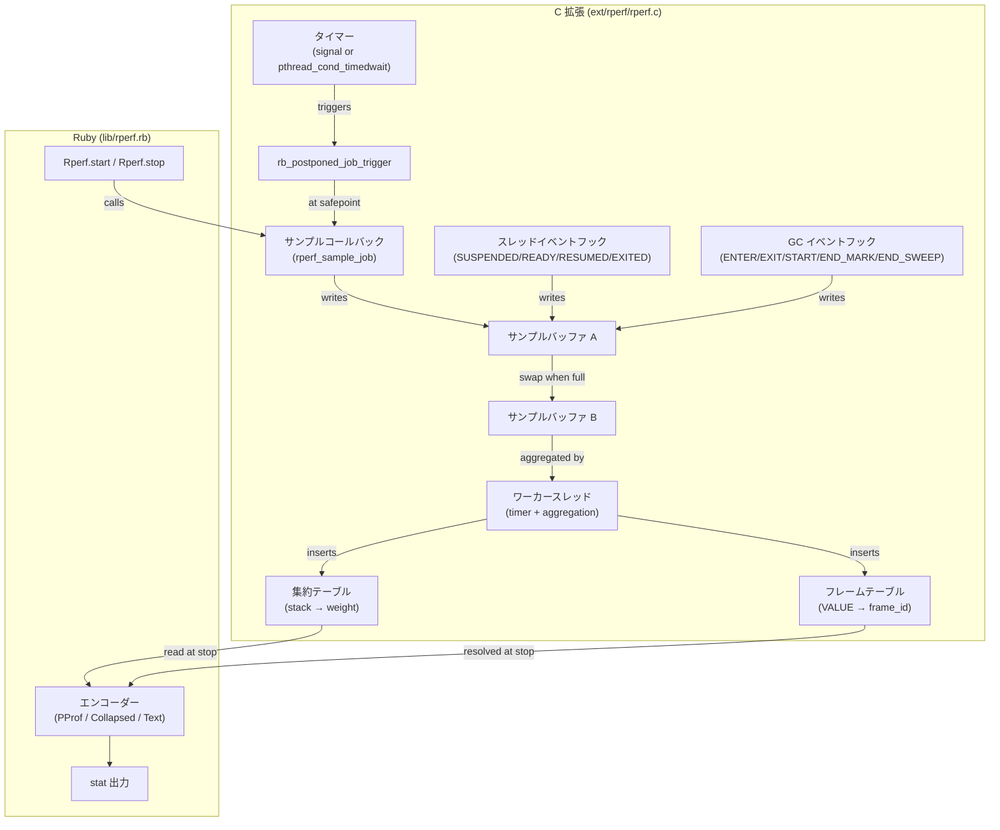

# アーキテクチャ概要

この章では、rperf のハイレベルなアーキテクチャと、プロファイリングを支えるコアデータ構造を説明します。これらの内部構造を理解することで、プロファイリング結果のエッジケースの解釈や設計上のトレードオフの評価に役立ちます。

## システム図

rperf は C 拡張と Ruby ラッパーで構成されています:

C 拡張はすべての性能重視の操作（タイマー管理、サンプル記録、集約）を処理します。Ruby レイヤーはユーザー向け API、出力エンコーディング、統計のフォーマットを提供します。

## グローバルプロファイラ状態

rperf は単一のグローバルな `rperf_profiler_t` 構造体を使用します。一度に 1 つのプロファイリングセッションのみ有効です（[単一セッション](#index:single session)制限）。この構造体は以下を保持します:

- タイマー設定（周波数、モード、シグナル番号）
- ダブルバッファリングされたサンプルストレージ（2 つのサンプルバッファ + フレームプール、満杯時にスワップ）
- フレームテーブル（VALUE → uint32 frame_id、フレーム参照の重複排除）
- 集約テーブル（ユニークスタック → 累積重み）
- ワーカースレッドハンドル（統合タイマー + 集約スレッド）
- スレッドごとのデータ用のスレッド固有キー
- GC フェーズ追跡状態
- サンプリングオーバーヘッドカウンター

## スレッドごとのデータ

各スレッドには Ruby のスレッド固有データ API（`rb_internal_thread_specific_set`）で格納される `rperf_thread_data_t` 構造体があります。以下を追跡します:

- `prev_time_ns`: 前回の時刻読み取り（重み計算用）
- `prev_wall_ns`: 前回の wall time 読み取り
- `suspended_at_ns`: スレッドがサスペンドされた wall タイムスタンプ
- `ready_at_ns`: スレッドが準備完了になった wall タイムスタンプ
- （バックトレースは SUSPENDED 時には保存せず、RESUMED 時に再取得します）
- `label_set_id`: 現在のラベルセット ID（0 = ラベルなし）

スレッドデータは最初の検出時に遅延作成され、`EXITED` イベントまたはプロファイラ停止時に解放されます。

## GC 安全性

フレーム VALUE はガベージコレクションから保護する必要があります。rperf はプロファイラ構造体を `TypedData` オブジェクトでラップし、3 つの領域をマークするカスタム `dmark` 関数を持ちます:

1. **両方のフレームプール**（アクティブバッファとスタンバイバッファ）
2. **フレームテーブルキー**（ユニークフレーム VALUE）

フレームテーブルキー配列は 4,096 エントリから始まり、満杯時に 2 倍に拡張されます。拡張時は新しい配列を確保し、既存データをコピーし、ポインタをアトミックにスワップします（`memory_order_release`）。古い配列は `stop` まで保持され、GC の mark フェーズが同時にそれを読み取っている場合の use-after-free を防ぎます。`dmark` 関数はキーポインタを `memory_order_acquire` でロードし、カウントも `memory_order_acquire` でロードして一貫したビューを保証します。

## Fork 安全性とマルチプロセス プロファイリング

### Fork 安全性（C レベル）

rperf は fork された子プロセスでプロファイリングを静かに停止する `pthread_atfork` 子ハンドラを登録します（[fork 安全性](#index:fork safety)）:

- タイマー/シグナル状態をクリア
- mutex/condvar を再初期化（fork 時に親のワーカースレッドがロックしていた可能性がある）
- イベントフック（スレッドイベント、GC イベント）を削除
- サンプルバッファ、フレームテーブル、集約テーブルを解放
- GC 状態、統計、profile refcount をリセット

親プロセスは影響を受けずにプロファイリングを継続します。子プロセスは必要に応じて新しいプロファイリングセッションを開始できます。

### マルチプロセス プロファイリング（Ruby レベル）

[マルチプロセス プロファイリング](#index:multi-process profiling)が有効な場合（CLI のデフォルト）、rperf は Ruby の `Process._fork` フック（Ruby 3.1 以降）を使用して、fork された子プロセスで自動的にプロファイリングを再開します。流れは:

1. **fork 前**: `_fork` フックが[セッションディレクトリ](#index:session directory)を作成（初回 fork 時のみ）。ルートプロセスの出力先がセッションディレクトリにリダイレクトされます。
2. **子プロセス内**: `pthread_atfork` が C 状態をクリーンアップした後、`_restart_in_child` が新しいプロファイリングセッションを開始。出力先はセッションディレクトリ。`%pid` ラベルが設定されます。
3. **子プロセス終了時**: 継承された `at_exit` フックが `Rperf.stop` を呼び、子のプロファイルを `.json.gz` ファイルとしてセッションディレクトリに書き込みます。
4. **ルートプロセス終了時**: ルートが自身のプロファイルを書き込んだ後、セッションディレクトリ内のすべての `.json.gz` ファイルを集約して単一の出力（stat レポートまたはファイル）を生成。その後セッションディレクトリを削除します。

spawn された子プロセス（`spawn`、`system`）の場合、子は `RUBYLIB`（rperf の lib ディレクトリを指す）と `RUBYOPT=-rrperf`、および環境変数（`RPERF_SESSION_DIR`、`RPERF_ROOT_PROCESS`）を継承します。子の Ruby プロセスが rperf を読み込むと、オートスタートブロックがルートプロセスでないことを検出し、プロファイルをセッションディレクトリに直接書き込みます。

### セッションディレクトリ

セッションディレクトリは `$RPERF_TMPDIR`、`$XDG_RUNTIME_DIR`、またはシステムの一時ディレクトリ（優先順）の下に、ユーザーごとのサブディレクトリ（`rperf-$UID/`、モード 0700）内に作成されます。各セッションは一意のディレクトリ名を持ちます: `rperf-$PID-$RANDOM`。

クラッシュしたプロセスの古いセッションディレクトリは自動的にクリーンアップされます: 新しい CLI セッション開始時に、ルート PID が生存していないセッションディレクトリを検出して削除します。

### ラベルのマージ

複数プロセスのプロファイルを集約する際、[ラベルセット](#index:label set)は一貫性を保つために再マッピングされます。2 つの子プロセスが同じラベル値を使用している場合（例: 両方とも `endpoint: "GET /users"`）、マージ後の出力で同じラベルセット ID を共有します。`%pid` ラベルにより、マージ後も異なるプロセスのサンプルを区別できます。

## 既知の制限事項

### Running EC レース

Ruby VM には、タイマースレッドからの `rb_postponed_job_trigger` が誤ったスレッドの実行コンテキストに割り込みフラグを設定してしまう既知のレース条件があります。これは、新しいスレッドのネイティブスレッドが GVL を取得する前に開始された場合に発生します。結果として、C のビジーウェイトを行っているスレッドのタイマーサンプルが欠落し、その CPU 時間が次の SUSPENDED イベントのスタックに漏れ出す可能性があります。

これは rperf のバグではなく Ruby VM のバグであり、すべての postponed job ベースのプロファイラに影響します。

ただし、rperf は Linux において `SIGEV_THREAD_ID` を使用してタイマーシグナルを専用のワーカースレッドにのみ配信することで、この問題を緩和しています。任意の Ruby スレッド上でシグナルハンドラが発火するのではなく、ワーカースレッド自身が `rb_postponed_job_trigger` を呼び出すため、古い `running_ec` を参照するレースウィンドウが大幅に狭くなります。nanosleep フォールバック（macOS および `signal: false`）も同様に、ワーカースレッドが `rb_postponed_job_trigger` の唯一の呼び出し元であるため、同じ効果があります。

### 単一セッション

グローバルプロファイラ状態のため、一度に 1 つのプロファイリングセッションのみ有効です。プロファイリング中に `Rperf.start` を呼び出すことはサポートされていません。

### メソッドレベルの粒度

rperf はメソッドレベルでプロファイルし、行レベルではありません。フレームラベルは修飾名（例: `Integer#times`、`MyClass#method_name`）に `rb_profile_frame_full_label` を使用します。行番号は含まれません。
