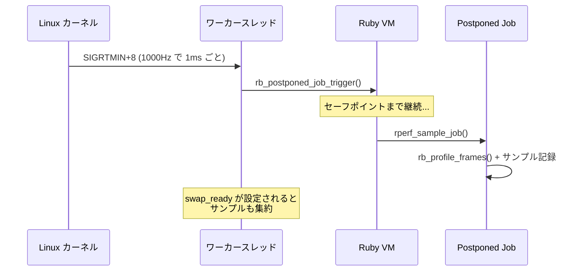
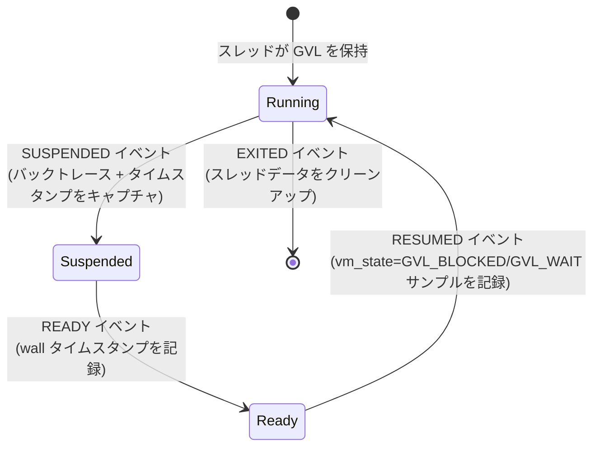

# サンプリング

この章では、rperf がサンプルを収集する方法を説明します。サンプリングをトリガーするタイマーメカニズム、サンプリングコールバック自体、そして GVL と GC のアクティビティをキャプチャするイベントフックについて解説します。

## タイマーとワーカースレッド

rperf は、タイマーのトリガーと定期的なサンプル集約の両方を処理する単一のワーカースレッドを使用します。タイマーメカニズムはプラットフォームによって異なります。

### Linux: シグナルベースのタイマー（デフォルト）

Linux では、rperf は `timer_create` と `SIGEV_THREAD_ID` を使用して、設定された周波数でワーカースレッドにのみリアルタイムシグナル（デフォルト: `SIGRTMIN+8`）を配信します。シグナルハンドラは `rb_postponed_job_trigger` を呼び出してサンプリングコールバックをスケジュールします。

`SIGEV_THREAD_ID` を使用することで、タイマーシグナルがワーカースレッドのみをターゲットにし、Ruby スレッドの `nanosleep`、`read`、その他のブロッキングシステムコール（例: `rb_thread_call_without_gvl` 内）を中断しないようにします。

このアプローチにより、正確なタイミング（1000Hz で中央値 ~1000us のインターバル）が実現されます。

### フォールバック: pthread_cond_timedwait

macOS、または Linux で `signal: false` が設定されている場合、ワーカースレッドは絶対デッドラインを持つ `pthread_cond_timedwait` をタイマーとして使用します:

- **タイムアウト**（デッドライン到達）: `rb_postponed_job_trigger` をトリガーし、デッドラインを進める
- **シグナル**（swap_ready が設定）: スタンバイバッファを即座に集約

デッドラインベースのアプローチにより、集約に時間がかかる場合のドリフトを回避します。このモードはシグナルベースのアプローチと比較して ~100us のタイミング不精度があります。

## サンプリングコールバック

postponed job が発火すると、`rperf_sample_job` は現在 GVL を保持しているスレッド上で実行されます。`rb_thread_current()` を使用してそのスレッドのみをサンプリングします。

これは意図的な設計判断です:

1. `rb_profile_frames` は現在のスレッドのスタックのみをキャプチャできる
2. `Thread.list` を反復する必要がない — GVL イベントフックと組み合わせることで、rperf はすべてのスレッドを広範にカバーします（ただし Ruby VM の[既知のレース](08-architecture.md#Running-EC-レース)により、サンプルが欠落する場合があります）

サンプリングコールバックの処理:

1. スレッドごとのデータ（`rperf_thread_data_t`）を取得または作成
2. 現在のクロックを読み取り（CPU モードは `CLOCK_THREAD_CPUTIME_ID`、wall モードは `CLOCK_MONOTONIC`）
3. 重みを `time_now - prev_time` として計算
4. `rb_profile_frames` でフレームプールに直接バックトレースをキャプチャ
5. サンプルを記録（フレーム開始インデックス、深さ、重み、`vm_state`）
6. `prev_time` を更新

`vm_state` フィールドは通常のタイマーサンプルでは `NORMAL`、GVL/GC イベントでは対応する状態（`GVL_BLOCKED`、`GVL_WAIT`、`GC_MARK`、`GC_SWEEP`）が設定されます。この `vm_state` は停止時に Ruby 側で `merge_vm_state_labels!` によって `%GVL`/`%GC` ラベルに変換されます。

## GVL イベント追跡（wall モード）

wall モードでは、rperf は Ruby のスレッドイベント API にフックして GVL の遷移を追跡します。これにより、サンプリングだけでは見逃す時間（GVL 外の時間）をキャプチャします。

### SUSPENDED

スレッドが GVL を解放するとき（例: I/O の前）:

1. 現在のバックトレースをフレームプールにキャプチャ
2. 通常のサンプルを記録（前回のサンプルからの時間）
3. 後で使用するためにバックトレースと wall タイムスタンプを保存

### READY

スレッドが実行可能になったとき（例: I/O 完了）:

1. wall タイムスタンプを記録（GVL 不要 — シンプルな C 操作のみ）

### RESUMED

スレッドが GVL を再取得したとき:

1. `vm_state=GVL_BLOCKED` のサンプルを記録: 重み = `ready_at - suspended_at`（GVL 外の時間）
2. `vm_state=GVL_WAIT` のサンプルを記録: 重み = `resumed_at - ready_at`（GVL 競合時間）
3. 両方のサンプルは SUSPENDED でキャプチャされたバックトレースを再利用

これにより、スレッドが GVL 外にある間はタイマーベースのサンプリングが不可能であるにもかかわらず、GVL 外の時間と GVL 競合がそれらをトリガーしたコードに正確に帰属されます。停止時に `vm_state` は `%GVL=blocked`/`%GVL=wait` ラベルに変換されます。

## GC フェーズ追跡

rperf は Ruby の内部 GC イベントにフックしてガベージコレクション時間を追跡します:

| イベント | アクション |
|-------|--------|
| `GC_START` | フェーズを marking に設定 |
| `GC_END_MARK` | フェーズを sweeping に設定 |
| `GC_END_SWEEP` | フェーズをクリア |
| `GC_ENTER` | バックトレース + wall タイムスタンプをキャプチャ |
| `GC_EXIT` | `vm_state=GC_MARK` または `vm_state=GC_SWEEP` のサンプルを記録 |

GC サンプルはプロファイリングモードに関係なく常に wall time を使用します。GC 時間はアプリケーションのレイテンシに影響する実際の経過時間だからです。停止時に `vm_state` は `%GC=mark`/`%GC=sweep` ラベルに変換されます。

## 遅延文字列解決

サンプリング中、rperf はフレームプールに生のフレーム `VALUE`（Ruby 内部のオブジェクト参照）を格納します。文字列ではありません。この[遅延文字列解決](#index:deferred string resolution)により、ホットパスがアロケーションフリーかつ高速に保たれます。

文字列解決は停止時に行われます:

1. `Rperf.stop` が `_c_stop` を呼び出す
2. フレームテーブルが各ユニークフレーム VALUE を `rb_profile_frame_full_label` と `rb_profile_frame_path` で `[path, label]` 文字列ペアにマッピング
3. 解決された文字列が Ruby エンコーダーに渡される

これにより、サンプリングは事前確保されたバッファに整数（VALUE ポインタとタイムスタンプ）のみを書き込みます。Ruby オブジェクトは作成されず、プロファイリング中に GC プレッシャーが追加されません。
