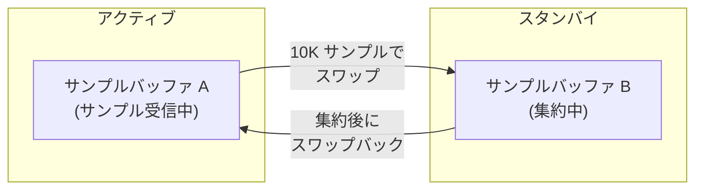

# 集約

この章では、rperf が生サンプルをコンパクトで重複排除されたデータ構造に処理する方法を説明します。集約により、長時間のプロファイリングセッション中のメモリ使用量が抑制されます。

## 概要

デフォルト（`aggregate: true`）では、rperf はバックグラウンドで定期的にサンプルを集約します。生サンプル（それぞれスタックトレース、重み、メタデータを含む）は、フレームテーブルと集約テーブルの 2 つのハッシュテーブルにマージされます。同一スタックは重みを合計してまとめられます。

## ダブルバッファリング

2 つのサンプルバッファが役割を交互に切り替え、サンプリングと集約の同時実行を可能にします:

1. **アクティブバッファ**がサンプリングコールバックからの新しいサンプルを受け取る
2. アクティブバッファが 10,000 サンプルに達するとバッファがスワップ
3. **スタンバイバッファ**がワーカースレッドによってバックグラウンドで処理される

ワーカースレッドがスタンバイバッファの処理を完了していない場合、スワップはスキップされ、アクティブバッファは増大を続けます（無制限モードへのフォールバック）。

各バッファは独自のフレームプールを持ちます。アクティブバッファのフレームプールは `rb_profile_frames` からの生の `VALUE` 参照を受け取ります。バッファがスワップされると、スタンバイバッファのフレームプールが処理され、再利用のためにクリアされます。

## フレームテーブル

フレームテーブル（`VALUE → uint32_t frame_id`）はフレーム参照を重複排除します。各ユニークフレーム VALUE に小さな整数 ID が割り当てられます。

- キー: 生のフレーム VALUE（集約データの唯一の GC マーク対象）
- 値: 集約テーブルで使用されるコンパクトな uint32_t ID
- 初期容量: 4,096 エントリ、満杯時に 2 倍に拡張
- 拡張は GC dmark 安全性のためにアトミックポインタスワップを使用（[GC 安全性](08-architecture.md#GC-安全性)を参照）

完全な VALUE の代わりに uint32_t フレーム ID を使用することで、集約テーブルでのスタック格納に必要なメモリが半減します。

## 集約テーブル

集約テーブルは同一スタックの重みを合計してマージします:

- **キー**: `(frame_ids[], thread_seq, label_set_id, vm_state)` — スタック（フレーム ID として）、スレッド連番、ラベルセット、VM 状態
- **値**: ナノ秒単位の累積重み

フレーム ID は別のスタックプールに連続して格納されます。各集約テーブルエントリはこのプールを指します（開始インデックス + 深さ）。

`vm_state` フィールドがキーの一部であるため、同じスタックでも GVL/GC の状態が異なるサンプルは別々に保持されます。停止時に `vm_state` は Ruby 側で `%GVL`/`%GC` ラベルに変換され、`label_sets` にマージされます。

`label_set_id` もキーの一部であるため、同じスタックでも異なるユーザーラベルを持つサンプルは別々に保持されます。

## メモリ使用量

| バッファ | 初期サイズ | 要素サイズ | 初期メモリ |
|--------|-------------|-------------|----------------|
| サンプルバッファ (×2) | 16,384 | 32B | 512KB × 2 |
| フレームプール (×2) | 131,072 | 8B (VALUE) | 1MB × 2 |
| フレームテーブルキー | 4,096 | 8B (VALUE) | 32KB |
| フレームテーブルバケット | 8,192 | 4B (uint32) | 32KB |
| 集約テーブルバケット | 2,048 | 28B | 56KB |
| スタックプール | 4,096 | 4B (uint32) | 16KB |

合計: `aggregate: true` で約 3.6MB、`aggregate: false`（単一バッファのみ）で約 1.5MB。フレームテーブルと集約テーブルは必要に応じて動的に拡張されます。

集約が有効な場合、メモリ使用量はプロファイリング時間に関係なくほぼ一定です。重要なのは収集されたサンプルの総数ではなく、ユニークスタックの数のみです。
